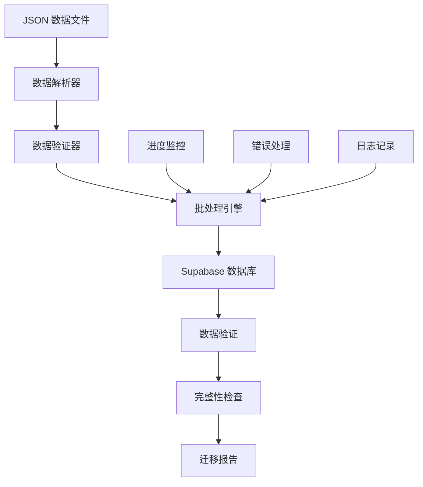

# 数据迁移 MVP 设计文档

## 概述

数据迁移 MVP 系统负责将 CIE Copilot 项目中现有的 JSON 格式学习资料高效、准确地迁移到 Supabase 数据库中。系统采用批处理架构，支持增量更新、错误恢复和数据验证，确保学习内容的完整性和可用性。

## 架构设计

### 系统架构图



### 技术栈选择

**数据处理：**
- **Node.js** - 脚本执行环境
- **fs/promises** - 异步文件操作
- **JSON.parse** - 原生 JSON 解析

**数据库：**
- **Supabase Client** - 数据库连接和操作
- **PostgreSQL** - 底层数据存储
- **批量插入** - 优化性能的 upsert 操作

**监控和日志：**
- **Console 输出** - 实时进度显示
- **文件日志** - 详细操作记录
- **错误追踪** - 异常处理和恢复

## 组件设计

### 1. 数据解析器 (Data Parser)

```javascript
class DataParser {
  // 解析 JSON 文件
  async parseJsonFile(filePath) {
    const content = await fs.readFile(filePath, 'utf8');
    return JSON.parse(content);
  }
  
  // 提取学科信息
  extractSubjectInfo(filename) {
    const patterns = {
      '9709': 'Mathematics',
      '9231': 'Further Mathematics', 
      '9702': 'Physics'
    };
    // 解析逻辑
  }
  
  // 标准化数据格式
  normalizeTopicData(rawData) {
    return {
      id: rawData.id || rawData.topicId,
      title: rawData.title || rawData.name,
      content: rawData.content || rawData.description,
      // 其他字段标准化
    };
  }
}
```

### 2. 批处理引擎 (Batch Processor)

```javascript
class BatchProcessor {
  constructor(batchSize = 50) {
    this.batchSize = batchSize;
    this.processedCount = 0;
    this.errorCount = 0;
  }
  
  // 批量处理数据
  async processBatch(dataArray) {
    const batches = this.createBatches(dataArray);
    
    for (const batch of batches) {
      try {
        await this.processSingleBatch(batch);
        this.updateProgress();
      } catch (error) {
        await this.handleBatchError(batch, error);
      }
    }
  }
  
  // 单批次处理
  async processSingleBatch(batch) {
    const { data, error } = await supabase
      .from('topics')
      .upsert(batch, { onConflict: 'paper_id,topic_id' });
      
    if (error) throw error;
    return data;
  }
}
```

### 3. 数据验证器 (Data Validator)

```javascript
class DataValidator {
  // 验证必需字段
  validateRequiredFields(record) {
    const required = ['title', 'content', 'paper_id'];
    const missing = required.filter(field => !record[field]);
    
    if (missing.length > 0) {
      throw new Error(`Missing required fields: ${missing.join(', ')}`);
    }
  }
  
  // 验证数据类型
  validateDataTypes(record) {
    const typeChecks = {
      title: 'string',
      content: 'object',
      difficulty_level: 'number'
    };
    
    for (const [field, expectedType] of Object.entries(typeChecks)) {
      if (record[field] && typeof record[field] !== expectedType) {
        throw new Error(`Invalid type for ${field}: expected ${expectedType}`);
      }
    }
  }
  
  // 验证数据完整性
  async validateDataIntegrity() {
    // 检查数据库中的记录数量
    const { count: topicCount } = await supabase
      .from('topics')
      .select('*', { count: 'exact', head: true });
      
    // 与源文件对比
    const sourceCount = await this.countSourceRecords();
    
    return {
      database: topicCount,
      source: sourceCount,
      match: topicCount === sourceCount
    };
  }
}
```

### 4. 进度监控器 (Progress Monitor)

```javascript
class ProgressMonitor {
  constructor(totalItems) {
    this.totalItems = totalItems;
    this.processedItems = 0;
    this.startTime = Date.now();
  }
  
  // 更新进度
  updateProgress(increment = 1) {
    this.processedItems += increment;
    const percentage = (this.processedItems / this.totalItems * 100).toFixed(1);
    const elapsed = Date.now() - this.startTime;
    const eta = this.calculateETA(elapsed);
    
    console.log(`Progress: ${percentage}% (${this.processedItems}/${this.totalItems}) - ETA: ${eta}`);
  }
  
  // 计算预计完成时间
  calculateETA(elapsed) {
    if (this.processedItems === 0) return 'Unknown';
    
    const rate = this.processedItems / elapsed;
    const remaining = this.totalItems - this.processedItems;
    const etaMs = remaining / rate;
    
    return this.formatTime(etaMs);
  }
}
```

## 数据模型映射

### JSON 到数据库字段映射

```javascript
const fieldMapping = {
  // 数学 (9709) 映射
  mathematics: {
    'id': 'topic_id',
    'title': 'title', 
    'description': 'content.description',
    'keyPoints': 'content.keyPoints',
    'examples': 'content.examples',
    'exercises': 'content.exercises',
    'difficulty': 'difficulty_level',
    'estimatedTime': 'estimated_time'
  },
  
  // 进阶数学 (9231) 映射
  furtherMathematics: {
    'topicId': 'topic_id',
    'name': 'title',
    'content': 'content.description',
    'key_points': 'content.keyPoints'
  },
  
  // 物理 (9702) 映射
  physics: {
    'id': 'topic_id',
    'title': 'title',
    'content': 'content.description'
  }
};
```

## 错误处理策略

### 1. 文件读取错误
- **重试机制：** 文件读取失败时重试 3 次
- **跳过策略：** 无法读取的文件记录到错误日志并跳过
- **用户通知：** 提供清晰的错误信息和修复建议

### 2. 数据格式错误
- **验证检查：** 每条记录处理前进行格式验证
- **数据修复：** 尝试自动修复常见的格式问题
- **手动审核：** 复杂问题标记为需要人工处理

### 3. 数据库操作错误
- **事务回滚：** 批次失败时回滚整个批次
- **连接重试：** 网络问题时自动重连
- **降级处理：** 批量操作失败时改为单条插入

## 性能优化

### 1. 批处理优化
- **动态批次大小：** 根据系统性能调整批次大小
- **并发控制：** 限制同时处理的批次数量
- **内存管理：** 及时释放已处理的数据

### 2. 数据库优化
- **索引利用：** 确保 upsert 操作使用适当的索引
- **连接池：** 复用数据库连接减少开销
- **预编译语句：** 提高 SQL 执行效率

### 3. 监控和日志
- **实时监控：** 显示处理进度和性能指标
- **详细日志：** 记录所有操作和错误信息
- **性能分析：** 识别性能瓶颈和优化机会