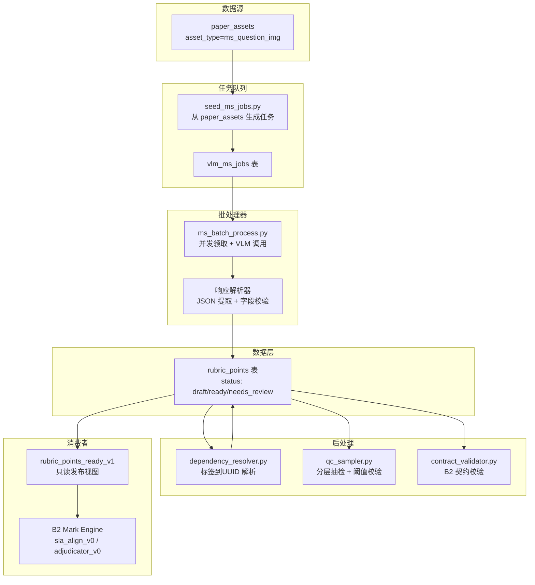
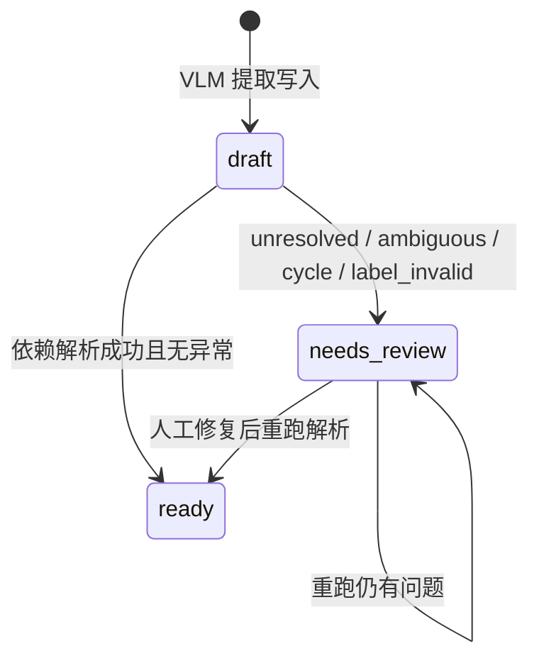

# 设计文档：Mark Scheme 结构化提取（B1 Rubric 数据层）

## 概述

本设计实现 B1 里程碑：从 CIE Mark Scheme 截图中提取结构化评分点（rubric points），构建可审计、可重跑、可供 B2 Mark Engine 直接消费的数据层。

系统采用两阶段策略：
1. **VLM 提取阶段**：调用 DashScope qwen-vl 模型，从 `ms_question_img` 截图提取评分点 JSON
2. **依赖解析阶段**：将文本标签（如 `["M1"]`）解析为 `rubric_id`（UUID），检测环、歧义、未解析

整体架构复用现有 `batch_process_v0.py` 的并发领取 + 线程池模式，新增 MS 专用任务表、rubric 数据表、依赖解析器、QC 抽检器和 B2 契约校验脚本。

## 架构



## 组件与接口

### 1. 任务种子脚本 `scripts/ms/seed_ms_jobs.py`

从 `paper_assets` 筛选 `asset_type='ms_question_img'`，向 `vlm_ms_jobs` 插入任务。使用 `ON CONFLICT DO NOTHING` 保证幂等。

```python
def seed_ms_jobs(
    extractor_version: str,
    provider: str = "dashscope",
    model: str = "qwen-vl-max",
    prompt_version: str = "ms_v1",
    dry_run: bool = False,
) -> dict:
    """从 paper_assets 生成 MS 提取任务。返回 {inserted, skipped, total}。"""
```

### 2. 批处理器 `scripts/ms/ms_batch_process.py`

复用 `batch_process_v0.py` 的并发模式（ThreadPoolExecutor + SELECT FOR UPDATE SKIP LOCKED），但使用 MS 专用表和 prompt。

核心接口：

```python
@dataclass
class MSConfig:
    workers: int = 4
    max_jobs: int | None = None
    status: list[str] = field(default_factory=lambda: ["pending"])
    stale_timeout_seconds: int = 600
    heartbeat_seconds: int = 120
    dry_run: bool = False
    model: str = "qwen-vl-max"
    base_url: str = "https://dashscope.aliyuncs.com/compatible-mode/v1"
    assets_root: Path = field(default_factory=lambda: Path(os.environ.get("ASSETS_ROOT", ".")))

def claim_ms_job(pool, worker_id: str, config: MSConfig) -> dict | None:
    """原子领取一个 MS 任务，使用 SELECT FOR UPDATE SKIP LOCKED。"""

def heartbeat(pool, job_id: str, worker_id: str) -> None:
    """刷新 locked_at 避免长任务被误回收。"""

def create_ms_run(pool, config: MSConfig) -> str:
    """创建 vlm_ms_runs 记录并返回 run_id。"""

def finish_ms_run(pool, run_id: str, status: str, counts: dict, error_summary: str | None = None) -> None:
    """结束运行记录，写入统计与错误摘要。"""
```

### 3. MS Prompt 与响应解析 `scripts/ms/ms_prompt.py`

MS 专用 prompt 要求 VLM 输出评分点数组：

```python
def build_ms_prompt(job: dict) -> tuple[str, str]:
    """构建 MS 提取 prompt。返回 (system_prompt, user_prompt)。"""

def parse_ms_response(raw_text: str, job: dict) -> list[dict] | None:
    """解析 VLM 响应为评分点列表。

    每个评分点包含：
    - mark_label: str (如 "M1", "A1", "B1")
    - description: str
    - marks: int
    - depends_on_labels: list[str] (如 ["M1"])
    - ft_mode: str (默认 "none"，枚举: none/follow_through/carried_accuracy/unknown)
    - expected_answer_latex: str | None
    - confidence: float (0.0-1.0)
    - confidence_source: str (model/heuristic)

    支持 markdown code block 包裹的 JSON。
    解析失败返回 None。

    规范化规则：
    1. mark_label 去空格并大写；非法格式不在解析阶段报错，后续入库置 needs_review
    2. ft_mode 不在合法枚举时强制置为 "unknown"
    3. confidence 缺失时按启发式规则计算，并置 confidence_source='heuristic'
    """
```

VLM 输出 JSON schema：

```json
{
  "rubric_points": [
    {
      "mark_label": "M1",
      "description": "Use chain rule correctly",
      "marks": 1,
      "depends_on_labels": [],
      "ft_mode": "none",
      "expected_answer_latex": null,
      "confidence": 0.95
    }
  ]
}
```

### 4. 持久化层 `scripts/ms/ms_persist.py`

单事务完成 rubric_points upsert + vlm_ms_jobs 状态更新：

```python
def compute_point_fingerprint(
    mark_label: str,
    description: str,
    marks: int,
    depends_on_labels: list[str],
) -> str:
    """基于业务字段计算 SHA256 指纹，用于幂等去重。"""

def persist_rubric_points(
    pool,
    job: dict,
    points: list[dict],
    run_id: str,
    raw_json: str,
    response_sha256: str,
) -> str:
    """单事务 upsert rubric_points + 更新 vlm_ms_jobs。

    返回 job 最终状态 ('done' | 'error')。
    初始 status='draft'，等待依赖解析后升级。
    """
```

### 5. 依赖解析器 `scripts/ms/dependency_resolver.py`

独立于 VLM 调用，可单独重跑：

```python
def resolve_dependencies(
    pool,
    scope_key: tuple,
    dry_run: bool = False,
) -> dict:
    """在题目范围内解析 depends_on_labels -> depends_on (UUID[])。

    scope_key = (storage_key, q_number, coalesce(subpart,''), extractor_version, provider, model, prompt_version)

    解析规则：
    1. 精确匹配同题范围内的 mark_label
    2. 重复 label 时按最近前序 step_index 匹配
    3. 仍歧义 -> status='needs_review', parse_flags.ambiguous_candidates
    4. 无匹配 -> status='needs_review', parse_flags.unresolved_labels
    5. 检测环 -> status='needs_review', parse_flags.cycle=true
    6. 全部解析成功 -> status='ready'

    返回 {resolved, unresolved, ambiguous, cycles, total}。
    """

def detect_cycles(points: list[dict]) -> list[list[str]]:
    """检测依赖图中的环，返回环列表。"""
```

### 6. QC 抽检器 `scripts/ms/qc_sampler.py`

```python
def run_qc(
    pool,
    output_path: str = "docs/reports/b1_rubric_qc_report.md",
    append_b3_mapping: bool = True,
) -> dict:
    """分层抽样 + 阈值校验。

    抽样策略：按 syllabus_code/session/paper 分层
    样本数：max(80, ceil(0.05 * ready_rows))

    指标：
    - mark_label_accuracy
    - dependency_resolution_rate
    - needs_review_rate
    - ft_default_compliance

    报告输出要求：
    1. 主报告包含公式、样本分层分布、通过/失败状态、失败样本明细
    2. 附录 A 固定写入 B3 字段映射（decision.reason/rubric_id/run_id）
    3. 若任一阈值失败，release_status='release_blocked'

    返回 {metrics, passed, release_status, blocked_reasons, appendix_written}。
    """

def render_b3_mapping_appendix() -> str:
    """生成 QC 报告附录 A（B3 映射约定）。

    必含映射：
    - decision.reason -> user_errors.metadata.decision_reason
    - rubric_id -> user_errors.metadata.rubric_id
    - run_id -> user_errors.metadata.run_id
    - source_version -> user_errors.metadata.source_version
    """
```

### 7. B2 契约校验 `scripts/ms/contract_validator.py`

```python
def validate_b2_contract(pool) -> dict:
    """校验 rubric_points_ready_v1 视图输出可被 B2 直接消费。

    检查：
    1. 所有 ready 记录包含 B2 必需字段
    2. depends_on 内所有 UUID 在同题范围存在
    3. kind IN ('M','A','B')
    4. marks > 0

    返回 {valid, failures: [{rubric_id, reason}]}。
    """
```

### 8. B3 映射约定（由 QC 报告附录输出）

为满足 B3 闭环对接，`qc_sampler.py` 在报告附录 A 固定输出以下映射：

| B2/B1 字段 | B3 写入字段 | 说明 |
|---|---|---|
| `decision.reason` | `user_errors.metadata.decision_reason` | 判分原因 |
| `rubric_id` | `user_errors.metadata.rubric_id` | 丢分对应评分点 |
| `run_id` | `user_errors.metadata.run_id` | 可追溯到本次评分运行 |
| `source_version` | `user_errors.metadata.source_version` | `extractor:provider:model:prompt` |

兼容性说明：
- 当前 `user_errors` 仍存在 `(user_id, storage_key)` 唯一索引。
- 若 B3 后续采用“评分点级”多条错题记录，需要在 B3 实施阶段调整唯一策略。

## 数据模型

### vlm_ms_jobs 表

```sql
CREATE TABLE IF NOT EXISTS vlm_ms_jobs (
    job_id          UUID PRIMARY KEY DEFAULT gen_random_uuid(),
    storage_key     TEXT NOT NULL,
    sha256          TEXT NOT NULL,
    paper_id        UUID,
    syllabus_code   TEXT NOT NULL,
    session         TEXT NOT NULL,
    year            INT NOT NULL,
    paper           INT NOT NULL,
    variant         INT NOT NULL,
    q_number        INT NOT NULL,
    subpart         TEXT,
    extractor_version TEXT NOT NULL,
    provider        TEXT NOT NULL,
    model           TEXT NOT NULL,
    prompt_version  TEXT NOT NULL,
    status          TEXT NOT NULL DEFAULT 'pending'
                    CHECK (status IN ('pending','running','done','error')),
    attempts        INT NOT NULL DEFAULT 0,
    last_error      TEXT,
    locked_by       TEXT,
    locked_at       TIMESTAMPTZ,
    created_at      TIMESTAMPTZ DEFAULT now(),
    updated_at      TIMESTAMPTZ DEFAULT now(),
    UNIQUE (storage_key, sha256, extractor_version, provider, model, prompt_version)
);

CREATE INDEX IF NOT EXISTS idx_vlm_ms_jobs_status_locked
    ON vlm_ms_jobs(status, locked_at);
```

### vlm_ms_runs 表

```sql
CREATE TABLE IF NOT EXISTS vlm_ms_runs (
    run_id           UUID PRIMARY KEY DEFAULT gen_random_uuid(),
    started_at       TIMESTAMPTZ NOT NULL DEFAULT now(),
    finished_at      TIMESTAMPTZ,
    status           TEXT NOT NULL CHECK (status IN ('running','success','failed')),
    config           JSONB NOT NULL DEFAULT '{}'::jsonb,
    counts           JSONB NOT NULL DEFAULT '{}'::jsonb,
    error_summary    TEXT
);
```

### rubric_points 表

```sql
CREATE TABLE IF NOT EXISTS rubric_points (
    rubric_id           UUID PRIMARY KEY DEFAULT gen_random_uuid(),
    storage_key         TEXT NOT NULL,
    paper_id            UUID,
    q_number            INT NOT NULL,
    subpart             TEXT,
    step_index          INT NOT NULL,
    -- 核心内容
    mark_label          TEXT NOT NULL,
    kind                TEXT NOT NULL CHECK (kind IN ('M','A','B')),
    description         TEXT NOT NULL,
    marks               INT NOT NULL CHECK (marks > 0),
    depends_on_labels   TEXT[] NOT NULL DEFAULT '{}',
    depends_on          UUID[] NOT NULL DEFAULT '{}',
    ft_mode             TEXT NOT NULL DEFAULT 'none'
                        CHECK (ft_mode IN ('none','follow_through','carried_accuracy','unknown')),
    expected_answer_latex TEXT,
    -- 质量与状态
    confidence          NUMERIC NOT NULL DEFAULT 0.0
                        CHECK (confidence >= 0.0 AND confidence <= 1.0),
    confidence_source   TEXT NOT NULL DEFAULT 'model'
                        CHECK (confidence_source IN ('model','heuristic','manual')),
    status              TEXT NOT NULL DEFAULT 'draft'
                        CHECK (status IN ('draft','ready','needs_review')),
    parse_flags         JSONB NOT NULL DEFAULT '{}'::jsonb,
    -- 审计与版本
    source              TEXT NOT NULL DEFAULT 'vlm',
    run_id              UUID REFERENCES vlm_ms_runs(run_id) ON DELETE SET NULL,
    extractor_version   TEXT NOT NULL,
    provider            TEXT NOT NULL,
    model               TEXT NOT NULL,
    prompt_version      TEXT NOT NULL,
    raw_json            JSONB NOT NULL DEFAULT '{}'::jsonb,
    response_sha256     TEXT,
    point_fingerprint   TEXT NOT NULL,
    created_at          TIMESTAMPTZ DEFAULT now(),
    updated_at          TIMESTAMPTZ DEFAULT now(),
    -- ready 数据必须满足可发布标签约束
    CONSTRAINT chk_rp_mark_label_ready
        CHECK (status <> 'ready' OR mark_label ~ '^[MAB][0-9]+$')
);

CREATE INDEX IF NOT EXISTS idx_rp_storage_status
    ON rubric_points(storage_key, q_number, subpart, status);
CREATE INDEX IF NOT EXISTS idx_rp_fingerprint
    ON rubric_points(point_fingerprint);
CREATE UNIQUE INDEX IF NOT EXISTS uq_rp_scope_fingerprint_version
    ON rubric_points(
        storage_key,
        q_number,
        COALESCE(subpart, ''),
        point_fingerprint,
        extractor_version,
        provider,
        model,
        prompt_version
    );
```

### rubric_points_ready_v1 发布视图

```sql
CREATE OR REPLACE VIEW rubric_points_ready_v1 AS
SELECT
    rubric_id, storage_key, paper_id, q_number, subpart, step_index,
    mark_label, kind, description, marks,
    depends_on, ft_mode, expected_answer_latex,
    confidence, source, run_id, extractor_version,
    provider, model, prompt_version,
    concat_ws(':', extractor_version, provider, model, prompt_version) AS source_version
FROM rubric_points
WHERE status = 'ready';
```

### point_fingerprint 计算

```python
import hashlib, json

def compute_point_fingerprint(
    mark_label: str,
    description: str,
    marks: int,
    depends_on_labels: list[str],
) -> str:
    payload = json.dumps({
        "mark_label": mark_label,
        "description": description,
        "marks": marks,
        "depends_on_labels": sorted(depends_on_labels),
    }, sort_keys=True, ensure_ascii=False)
    return hashlib.sha256(payload.encode("utf-8")).hexdigest()
```

### 状态机



### kind 推导规则

| mark_label 首字母 | kind | 备注 |
|---|---|---|
| M | M | Method |
| A | A | Accuracy |
| B | B | Independent |
| 其他 | - | status='needs_review', parse_flags.label_invalid=true |

## 正确性属性（Correctness Properties）

*正确性属性是系统在所有合法执行路径上都应保持的特征或行为——本质上是对系统行为的形式化陈述。属性是人类可读规格与机器可验证正确性保证之间的桥梁。*

以下属性基于需求文档中的验收标准推导，每个属性都包含显式的"对于所有"量化语句，可直接转化为 property-based test。

### Property 1: 任务种子过滤正确性
*对于任意* `paper_assets` 数据集（包含混合 `asset_type`），`seed_ms_jobs` 生成的任务应仅对应 `asset_type='ms_question_img'` 的记录，且生成任务数等于符合条件的资产数。
**Validates: Requirements 1.2**

### Property 2: 原子领取互斥性
*对于任意* N 个并发 worker 同时领取任务，每个任务应恰好被一个 worker 领取，不存在同一任务被两个 worker 同时持有的情况。
**Validates: Requirements 1.4**

### Property 3: 过期任务回收
*对于任意* `running` 状态的任务，若 `locked_at` 距当前时间超过 `stale_timeout_seconds`，该任务应可被重新领取。
**Validates: Requirements 1.5**

### Property 4: 心跳刷新时效性
*对于任意* 正在运行的任务，调用 `heartbeat` 后 `locked_at` 应更新为更近的时间戳，且差值不超过合理误差。
**Validates: Requirements 1.6**

### Property 5: 状态过滤领取
*对于任意* 状态过滤集合 S 和任务队列，`claim_ms_job` 仅应返回 `status IN S` 或 `running_stale` 的任务。
**Validates: Requirements 1.7**

### Property 6: 响应解析完整性
*对于任意* 合法的 rubric points JSON（无论是否被 markdown code block 包裹），`parse_ms_response` 应提取出所有必需字段（mark_label, description, marks, depends_on_labels, ft_mode），且结果与直接解析裸 JSON 等价。
**Validates: Requirements 2.2, 2.3**

### Property 7: 可重试错误的退避重试
*对于任意* 前 K 次返回 HTTP 429 后第 K+1 次成功的 API 调用序列（K < max_retries），系统应最终返回成功结果，且实际重试间隔符合指数退避模式（base=2s * 2^attempt）。
**Validates: Requirements 2.4**

### Property 8: 非法 JSON 错误处理
*对于任意* 非合法 JSON 的字符串输入，`parse_ms_response` 应返回 None，且对应任务应被标记为 `error`，`last_error` 包含 `json_parse_failed`。
**Validates: Requirements 2.5**

### Property 9: 字段默认值填充
*对于任意* VLM 响应中缺少 `confidence` 或 `ft_mode` 的评分点，系统应填充默认值：`confidence` 使用启发式规则计算（0.0-1.0 范围内），`confidence_source='heuristic'`；`ft_mode='none'`。
**Validates: Requirements 2.6, 3.3**

### Property 10: 审计轨迹完整性
*对于任意* 持久化的 rubric point，`response_sha256` 应等于 `raw_json` 内容的 SHA256 哈希值，且 `raw_json` 应包含原始模型响应。
**Validates: Requirements 2.7**

### Property 11: kind 推导正确性
*对于任意* `mark_label`，若首字母为 M/A/B 则 `kind` 应等于该字母；若首字母不在 M/A/B 中，则 `status` 应为 `needs_review` 且 `parse_flags.label_invalid=true`。
**Validates: Requirements 3.2**

### Property 12: 指纹确定性与抗碰撞
*对于任意* 两组评分点输入 (mark_label, description, marks, depends_on_labels)：
- 相同输入应产生相同 fingerprint（确定性）
- 任一字段不同应产生不同 fingerprint（抗碰撞）
**Validates: Requirements 3.4**

### Property 13: Upsert 幂等性
*对于任意* 同一题目同版本的评分点集合，执行两次 `persist_rubric_points` 后 `rubric_points` 表中的记录数应与执行一次相同（f(x) = f(f(x))）。
**Validates: Requirements 1.3, 3.5, 3.6**

### Property 14: 持久化事务原子性
*对于任意* `persist_rubric_points` 调用，要么 `rubric_points` upsert 和 `vlm_ms_jobs` 状态更新同时成功，要么两者都不变（全有或全无）。
**Validates: Requirements 3.7**

### Property 15: 依赖解析范围隔离
*对于任意* 两个不同 scope_key 的题目，一个题目的依赖解析不应引用另一个题目的 rubric_id。
**Validates: Requirements 4.1**

### Property 16: 成功依赖解析
*对于任意* 题目范围内 `depends_on_labels` 中的标签在同范围内有唯一匹配，`depends_on` 应包含对应的 `rubric_id`，且 `status` 应为 `ready`。
**Validates: Requirements 4.2**

### Property 17: 未解析标签处理
*对于任意* `depends_on_labels` 中包含同范围内不存在的标签的评分点，`status` 应为 `needs_review`，且 `parse_flags.unresolved_labels` 应包含该标签。
**Validates: Requirements 4.3**

### Property 18: 歧义标签处理
*对于任意* 同题范围内存在重复 `mark_label` 的情况，解析器应优先按最近前序 `step_index` 匹配；若仍歧义，`status` 应为 `needs_review`，且 `parse_flags.ambiguous_candidates` 应记录候选列表。
**Validates: Requirements 4.4**

### Property 19: 依赖环检测
*对于任意* 包含环的依赖图（A->B->C->A），环中所有评分点的 `status` 应为 `needs_review`，且 `parse_flags.cycle=true`。
**Validates: Requirements 4.5**

### Property 20: 状态机转换合法性
*对于任意* rubric point，状态转换应仅遵循：draft->ready, draft->needs_review, needs_review->ready, needs_review->needs_review。不应出现 ready->draft 或 ready->needs_review 的逆向转换。
**Validates: Requirements 4.7**

### Property 21: Ready 视图契约
*对于任意* `rubric_points` 数据集（包含 draft/ready/needs_review 混合状态），`rubric_points_ready_v1` 视图应仅返回 `status='ready'` 的记录，且每条记录包含 B2 必需字段（rubric_id, mark_label, description, kind, depends_on, marks）和 B3 必需字段（storage_key, q_number, subpart, rubric_id, mark_label, kind, source_version）。
**Validates: Requirements 5.1, 5.2, 10.1**

### Property 22: depends_on 引用完整性
*对于任意* `status='ready'` 的评分点，`depends_on` 数组中的每个 UUID 应在同题范围内存在对应的 `rubric_id`。
**Validates: Requirements 5.3**

### Property 23: 契约校验失败报告
*对于任意* 包含无效记录的数据集，`validate_b2_contract` 应返回所有失败记录的 `rubric_id` 和失败原因，不遗漏。
**Validates: Requirements 5.5**

### Property 24: 分层抽样大小
*对于任意* ready 数据集，QC 抽样数应等于 `max(80, ceil(0.05 * ready_rows))`，且样本应覆盖所有 `syllabus_code/session/paper` 层。
**Validates: Requirements 6.1**

### Property 25: QC 指标计算正确性
*对于任意* 已知正确/错误标注的样本集，计算的 `mark_label_accuracy`、`dependency_resolution_rate`、`needs_review_rate`、`ft_default_compliance` 应与手动计算结果一致。
**Validates: Requirements 6.2**

### Property 26: 阈值通过/失败判定
*对于任意* 指标组合，当且仅当所有指标满足阈值（accuracy>=0.90, resolution>=0.95, review<=0.20, ft_compliance=1.00）时结果为 passed；否则为 release_blocked。
**Validates: Requirements 6.3**

### Property 27: CLI 配置解析
*对于任意* 合法 CLI 参数组合，解析后的 MSConfig 应正确反映所有参数值，未指定参数应使用默认值。
**Validates: Requirements 7.1**

### Property 28: Dry-run 无副作用
*对于任意* dry_run=True 的执行，不应产生任何 API 调用或数据库写入。
**Validates: Requirements 7.2**

### Property 29: 汇总统计完整性
*对于任意* 已完成的批处理运行，汇总应包含 total_jobs, done, error, needs_review, api_calls, input_tokens, output_tokens, estimated_cost，且 total_jobs = done + error + needs_review。
**Validates: Requirements 7.4**

### Property 30: 错误日志结构
*对于任意* 失败的任务，错误日志应包含 job_id, storage_key, error_code, error_message 四个字段，且均非空。
**Validates: Requirements 7.5**

### Property 31: 迁移幂等性
*对于任意* 迁移脚本，执行两次应产生与执行一次相同的数据库状态（表、索引、约束均不变）。
**Validates: Requirements 8.2**

### Property 32: 数据库约束执行
*对于任意* 违反约束的数据（kind 不在 M/A/B、marks<=0、status 不在 draft/ready/needs_review、ft_mode 非法、confidence 越界、或 status='ready' 但 mark_label 不匹配 `^[MAB][0-9]+$`），数据库应拒绝插入。
**Validates: Requirements 8.3**

### Property 33: 重跑跳过已完成任务
*对于任意* 包含 done 状态任务的队列，重新运行批处理应仅处理 pending/error/running_stale 任务，done 任务不被重新处理。
**Validates: Requirements 8.5**

### Property 34: source_version 生成一致性
*对于任意* ready 记录，`source_version` 必须等于 `extractor_version:provider:model:prompt_version` 的稳定拼接结果。
**Validates: Requirements 10.1**

### Property 35: QC 报告附录映射完整性
*对于任意* QC 成功或失败运行，报告附录 A 必须包含四条映射：`decision.reason`、`rubric_id`、`run_id`、`source_version` 到 `user_errors.metadata.*`。
**Validates: Requirements 10.2**

### Property 36: B1 CI Gate 阻断行为
*对于任意* gate 运行，只要出现测试失败、QC `release_blocked` 或迁移检查失败，CI 结果必须为失败并输出失败产物。
**Validates: Requirements 9.3**

## 错误处理

### VLM 调用层

| 错误类型 | 处理策略 | 最终状态 |
|---|---|---|
| HTTP 429 / 5xx | 指数退避重试（base=2s, jitter, max 5 次） | 重试成功 -> 继续; 耗尽 -> error |
| JSON 解析失败 | 标记 `last_error='json_parse_failed'` | error |
| 网络超时 | 同 5xx 重试策略 | error |
| API key 无效 | 立即终止进程 | 进程退出 |

### 依赖解析层

| 错误类型 | 处理策略 | 最终状态 |
|---|---|---|
| 标签未匹配 | `parse_flags.unresolved_labels` 记录 | needs_review |
| 标签歧义 | 最近前序匹配，仍歧义则记录 `ambiguous_candidates` | needs_review |
| 依赖环 | `parse_flags.cycle=true` | needs_review |
| mark_label 格式非法 | `parse_flags.label_invalid=true` | needs_review |

### 持久化层

| 错误类型 | 处理策略 | 最终状态 |
|---|---|---|
| DB 连接失败 | 重试 3 次后标记 error | error |
| 唯一约束冲突 | upsert (ON CONFLICT DO UPDATE) | 正常 |
| 事务失败 | 回滚，标记 job error | error |

### 批处理层

| 错误类型 | 处理策略 | 最终状态 |
|---|---|---|
| Worker 异常 | 捕获异常，记录错误日志，继续下一任务 | error (当前任务) |
| SIGINT/SIGTERM | 设置 stop_event，优雅关闭 | 正常退出 |
| 连接池耗尽 | 等待可用连接 | 阻塞等待 |

## 测试策略

### 测试框架

- **单元测试**: pytest
- **Property-based 测试**: hypothesis（Python PBT 库）
- **集成测试**: pytest + 本地 PostgreSQL（或 Supabase local）

### Property-Based 测试配置

- 每个 property test 最少运行 100 次迭代
- 使用 `@settings(max_examples=100)` 配置 hypothesis
- 每个测试用注释标注对应的设计属性：
  ```python
  # Feature: ms-rubric-extraction, Property 12: 指纹确定性与抗碰撞
  @given(st.text(), st.text(), st.integers(min_value=1), st.lists(st.text()))
  def test_fingerprint_determinism(mark_label, desc, marks, deps):
      ...
  ```

### 单元测试重点

- markdown code block JSON 解析（含嵌套、空内容等边界）
- 429/5xx 重试策略（mock API）
- `point_fingerprint` 幂等去重
- unresolved / ambiguous / cycle 依赖解析
- stale reclaim + heartbeat
- kind 推导（M/A/B + 非法 label）
- CLI 参数解析

### Property-Based 测试重点

- P6: 响应解析完整性（随机合法 JSON + code block 包裹）
- P11: kind 推导正确性（随机 mark_label）
- P12: 指纹确定性与抗碰撞（随机字段组合）
- P13: Upsert 幂等性（随机评分点集合）
- P17/P18/P19: 依赖解析三种失败模式（随机依赖图）
- P21: Ready 视图契约（随机状态混合数据）
- P26: 阈值判定（随机指标组合）

### 集成测试重点

- 任务领取到落库的完整事务路径
- B2 契约字段可直接消费（导入 sla_align_v0 / adjudicator_v0 验证）
- 迁移 dry-run 无错误

### 测试文件组织

```
test/
├── test_ms_parse_response.py      # P6, P8 响应解析
├── test_ms_parse_response_pbt.py  # P6 property test
├── test_ms_fingerprint.py         # P12 指纹
├── test_ms_fingerprint_pbt.py     # P12 property test
├── test_ms_kind_derivation.py     # P11 kind 推导
├── test_ms_kind_pbt.py            # P11 property test
├── test_ms_dependency.py          # P15-P19 依赖解析
├── test_ms_dependency_pbt.py      # P17-P19 property test
├── test_ms_persist.py             # P13, P14 持久化
├── test_ms_qc.py                  # P24-P26 QC
├── test_ms_qc_pbt.py             # P26 property test
├── test_ms_contract.py            # P21-P23 契约
├── test_ms_cli.py                 # P27 CLI
├── test_ms_retry.py               # P7 重试
└── test_ms_integration.py         # 集成测试
```

## CI Gate 设计

### Gate 名称

- `b1-rubric-extraction-gate`

### Gate 执行顺序

1. **单元 + Property + 集成测试**
   - `pytest test/test_ms_*.py`
2. **QC 阈值校验**
   - `python scripts/ms/qc_sampler.py --enforce-thresholds --output docs/reports/b1_rubric_qc_report.md`
3. **迁移安全与 schema 验证**
   - `python scripts/db/check_migration_safety.py supabase/migrations/*.sql`
   - `DATABASE_URL=postgresql://... python scripts/db/verify_schema.py`

### Gate 通过条件

- 测试全部通过（exit code 0）
- QC 报告状态为 `passed=true` 且 `release_status != 'release_blocked'`
- 迁移安全检查与 schema 验证均通过

### Gate 失败产物

- `docs/reports/b1_rubric_qc_report.md`
- `runs/ms/b1_contract_failures.json`
- `runs/ms/b1_gate_summary.json`
