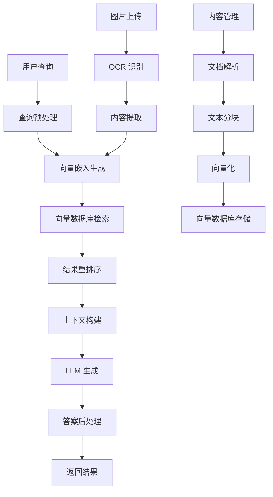

# RAG 知识库系统设计文档

## 概述

RAG (Retrieval-Augmented Generation) 知识库系统是 CIE Copilot 的核心智能组件，通过向量化存储和语义检索技术，为 AI 提供高质量的 A-Level 学科知识基础。系统采用现代化的向量数据库技术，结合先进的文本嵌入模型，实现毫秒级的知识检索和上下文增强生成。

## 架构设计

### 系统架构图



### 技术栈选择

**向量数据库：**
- **主选方案：** Supabase Vector (基于 pgvector)
- **备选方案：** Pinecone 或 Weaviate
- **理由：** 与现有 Supabase 基础设施集成，降低运维复杂度

**嵌入模型：**
- **主选：** OpenAI text-embedding-3-large
- **备选：** Cohere embed-multilingual-v3.0
- **理由：** 支持多语言，对数学和科学内容理解能力强

**文档处理：**
- **Markdown 处理：** unified + remark
- **LaTeX 处理：** katex + mathjs
- **JSON 解析：** 原生 JavaScript JSON 处理

## 组件设计

### 1. 内容摄取管道 (Content Ingestion Pipeline)

```typescript
interface ContentProcessor {
  // 文档解析器
  parseDocument(file: File): Promise<ParsedDocument>
  
  // 文本分块器
  chunkText(content: string, options: ChunkOptions): TextChunk[]
  
  // 向量化器
  generateEmbeddings(chunks: TextChunk[]): Promise<VectorEmbedding[]>
  
  // 存储器
  storeVectors(embeddings: VectorEmbedding[]): Promise<void>
}

interface ParsedDocument {
  id: string
  title: string
  subject: string
  paper: string
  topic?: string
  content: string
  metadata: DocumentMetadata
}

interface TextChunk {
  id: string
  content: string
  metadata: ChunkMetadata
  position: number
}
```

### 2. 向量检索引擎 (Vector Retrieval Engine)

```typescript
interface VectorRetriever {
  // 语义搜索
  semanticSearch(query: string, options: SearchOptions): Promise<SearchResult[]>
  
  // 混合搜索 (向量 + 关键词)
  hybridSearch(query: string, options: HybridOptions): Promise<SearchResult[]>
  
  // 多模态搜索 (文本 + 图片)
  multimodalSearch(query: MultimodalQuery): Promise<SearchResult[]>
}

interface SearchOptions {
  topK: number
  threshold: number
  filters: SearchFilters
  rerank: boolean
}

interface SearchResult {
  id: string
  content: string
  score: number
  metadata: ResultMetadata
  source: ContentSource
}
```

### 3. 上下文构建器 (Context Builder)

```typescript
interface ContextBuilder {
  // 构建检索增强上下文
  buildContext(query: string, results: SearchResult[]): Promise<RAGContext>
  
  // 优化上下文长度
  optimizeContext(context: RAGContext, maxTokens: number): RAGContext
  
  // 添加元信息
  enrichContext(context: RAGContext): Promise<EnrichedContext>
}

interface RAGContext {
  query: string
  relevantContent: ContentBlock[]
  metadata: ContextMetadata
  totalTokens: number
}
```


## 数据模型

### 向量存储表结构

```sql
-- 文档向量表
CREATE TABLE document_vectors (
  id UUID PRIMARY KEY DEFAULT gen_random_uuid(),
  document_id UUID REFERENCES documents(id),
  chunk_id TEXT NOT NULL,
  content TEXT NOT NULL,
  embedding VECTOR(1536), -- OpenAI embedding 维度
  metadata JSONB,
  created_at TIMESTAMP DEFAULT NOW(),
  updated_at TIMESTAMP DEFAULT NOW()
);

-- 创建向量索引
CREATE INDEX ON document_vectors USING ivfflat (embedding vector_cosine_ops);

-- 文档元数据表
CREATE TABLE documents (
  id UUID PRIMARY KEY DEFAULT gen_random_uuid(),
  title TEXT NOT NULL,
  subject_code TEXT NOT NULL,
  paper_code TEXT,
  topic_id TEXT,
  content_type TEXT NOT NULL, -- 'json', 'markdown', 'pdf'
  file_path TEXT,
  checksum TEXT,
  metadata JSONB,
  created_at TIMESTAMP DEFAULT NOW(),
  updated_at TIMESTAMP DEFAULT NOW()
);
```

### 检索配置表

```sql
-- 检索配置表
CREATE TABLE retrieval_configs (
  id UUID PRIMARY KEY DEFAULT gen_random_uuid(),
  name TEXT UNIQUE NOT NULL,
  embedding_model TEXT NOT NULL,
  chunk_size INTEGER DEFAULT 1000,
  chunk_overlap INTEGER DEFAULT 200,
  top_k INTEGER DEFAULT 10,
  similarity_threshold FLOAT DEFAULT 0.7,
  rerank_enabled BOOLEAN DEFAULT true,
  config_data JSONB,
  is_active BOOLEAN DEFAULT false,
  created_at TIMESTAMP DEFAULT NOW()
);
```

## 错误处理策略

### 1. 嵌入生成失败
- **重试机制：** 指数退避重试，最多 3 次
- **降级策略：** 使用备用嵌入模型或关键词搜索
- **监控告警：** 失败率超过 5% 时触发告警

### 2. 向量检索超时
- **超时设置：** 检索超时 2 秒，总超时 5 秒
- **缓存策略：** 热门查询结果缓存 1 小时
- **降级方案：** 使用全文搜索作为备选

### 3. OCR 识别错误
- **置信度检查：** 低于 80% 置信度时要求用户确认
- **多引擎验证：** 关键内容使用多个 OCR 引擎交叉验证
- **人工审核：** 提供人工审核接口处理复杂情况

## 测试策略

### 1. 单元测试
- **嵌入生成测试：** 验证向量维度和数值范围
- **文本分块测试：** 验证分块边界和重叠处理
- **检索准确性测试：** 使用标准数据集验证检索质量

### 2. 集成测试
- **端到端检索测试：** 从查询到结果的完整流程
- **多模态处理测试：** 图片上传到文本提取的完整链路
- **性能压力测试：** 并发检索和大批量数据处理

### 3. 质量评估
- **检索相关性评估：** 使用 NDCG、MRR 等指标
- **生成质量评估：** 基于专家标注的答案质量评分
- **用户满意度测试：** A/B 测试比较不同配置的效果

## 性能优化

### 1. 检索优化
- **索引优化：** 使用 IVF 索引加速向量检索
- **缓存策略：** Redis 缓存热门查询结果
- **预计算：** 预计算常见查询的向量表示

### 2. 存储优化
- **向量压缩：** 使用 PQ (Product Quantization) 压缩向量
- **分片策略：** 按学科和难度级别分片存储
- **冷热分离：** 热门内容使用 SSD，冷门内容使用 HDD

### 3. 计算优化
- **批处理：** 批量生成嵌入向量
- **GPU 加速：** 使用 GPU 加速向量计算
- **异步处理：** 非关键路径使用异步处理