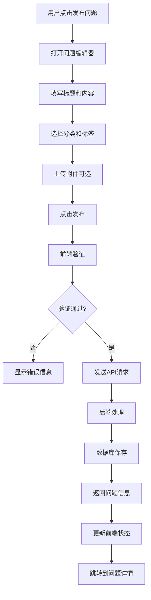
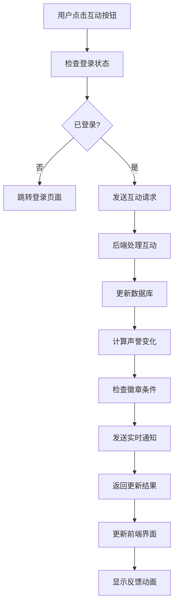
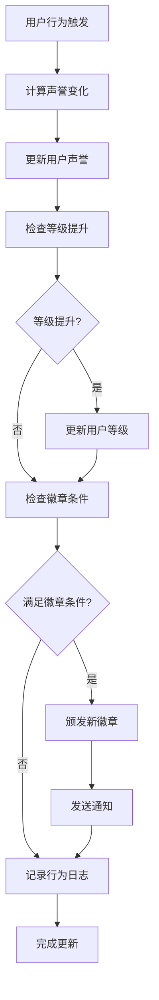

# 学习社区功能开发日志

## 📋 功能概述

本文档记录Agent B开发的学习社区组件(LearningCommunity.tsx)的详细实现，为Agent A后端开发提供完整的功能规格说明。

**组件文件**: `src/components/agent-b/LearningCommunity.tsx`  
**开发状态**: ✅ 已完成  
**对应API**: `/api/community/{subjectCode}/*`  
**更新时间**: 2025年1月18日

---

## 🎯 核心功能模块

### 1. 问答社区系统

#### 问题列表展示
- **功能**: 展示学科相关的问题列表
- **排序方式**: 最新、最热、未回答、趋势、最旧
- **过滤条件**: 问题分类、标签、状态、作者
- **分页加载**: 支持无限滚动和传统分页
- **搜索功能**: 标题和内容全文搜索

#### 问题详情页面
- **问题展示**: 完整问题内容、标签、分类
- **作者信息**: 用户头像、声誉、徽章显示
- **统计数据**: 浏览量、点赞数、回答数
- **互动功能**: 点赞、关注、收藏、分享
- **附件支持**: 图片、文档等附件展示

#### 回答系统
- **回答列表**: 按时间、点赞数、有用性排序
- **最佳答案**: 问题作者可标记最佳答案
- **专家验证**: 老师/专家认证标识
- **互动功能**: 点赞、标记有用、回复
- **富文本编辑**: 支持Markdown格式

### 2. 用户声誉系统

#### 声誉积分
- **问题发布**: +5分
- **回答问题**: +10分  
- **最佳答案**: +25分
- **获得点赞**: +2分
- **被标记有用**: +5分

#### 用户等级
- **新手**: 0-99分 (Level 1)
- **活跃**: 100-499分 (Level 2)
- **专家**: 500-1499分 (Level 3)
- **大师**: 1500-4999分 (Level 4)
- **导师**: 5000+分 (Level 5)

#### 徽章系统
- **贡献徽章**: 首次提问、首次回答、活跃贡献者
- **质量徽章**: 最佳答案专家、有用回答达人
- **里程碑徽章**: 百问达人、千答专家
- **学科徽章**: 数学专家、物理达人等
- **特殊徽章**: 社区之星、每日签到等

### 3. 内容管理功能

#### 问题发布
- **标题验证**: 长度限制、重复检测
- **内容编辑**: 富文本编辑器支持
- **分类选择**: 作业帮助、概念解释、考试相关等
- **标签添加**: 自动推荐、手动输入
- **附件上传**: 图片、PDF等文件支持
- **匿名选项**: 支持匿名发布

#### 内容审核
- **自动过滤**: 敏感词、垃圾内容检测
- **用户举报**: 不当内容举报机制
- **管理员审核**: 人工审核和处理
- **内容编辑**: 允许作者编辑问题和回答
- **删除管理**: 软删除和硬删除机制

### 4. 社交互动功能

#### 关注系统
- **关注用户**: 关注感兴趣的用户
- **关注问题**: 关注感兴趣的问题
- **动态推送**: 关注内容的更新通知
- **粉丝管理**: 查看粉丝和关注列表

#### 通知系统
- **即时通知**: 问题被回答、回答被点赞
- **系统通知**: 徽章获得、等级提升
- **邮件通知**: 重要活动邮件提醒
- **推送设置**: 个性化通知偏好设置

---

## 🎨 用户界面设计

### 1. 主页布局

```
┌─────────────────────────────────────────────┐
│  📚 Mathematics Community (9709)           │
├─────────────────────────────────────────────┤
│  [搜索框] [分类筛选] [排序] [发布问题]        │
├─────────────────────────────────────────────┤
│  📌 置顶问题 (Featured Questions)          │
│  ┌─────────────────────────────────────────┐ │
│  │ 💡 如何解决二次方程的复数根问题？       │ │
│  │ 👤 数学小天才 ⭐⭐⭐ | 👀 1.2k | 👍 89 │ │
│  └─────────────────────────────────────────┘ │
│                                             │
│  🔥 热门问题 (Trending Questions)          │
│  ┌─────────────────────────────────────────┐ │
│  │ ❓ 微积分极限计算技巧                   │ │
│  │ 👤 学霸助手 ⭐⭐ | 👀 856 | 💬 23      │ │
│  └─────────────────────────────────────────┘ │
│                                             │
│  📝 最新问题 (Latest Questions)            │
│  [问题列表...]                              │
└─────────────────────────────────────────────┘
```

### 2. 问题详情页面

```
┌─────────────────────────────────────────────┐
│  📖 问题详情                                │
├─────────────────────────────────────────────┤
│  🔺 微积分中洛必达法则的应用条件            │
│  📅 2小时前 | 👤 数学爱好者 ⭐⭐⭐           │
│  🏷️ 微积分 极限 洛必达                      │
│  👀 156 | 👍 23 | 💬 8                      │
│                                             │
│  📝 问题内容：                              │
│  我在学习微积分时，对洛必达法则的应用...    │
│                                             │
│  📎 附件：[图片] [公式.png]                 │
│                                             │
│  [👍 点赞] [⭐ 关注] [🔖 收藏] [📤 分享]   │
├─────────────────────────────────────────────┤
│  💬 8 个回答 (按最佳答案排序)               │
│                                             │
│  ✅ 最佳答案                                │
│  👤 数学教授 ⭐⭐⭐⭐⭐ ✓专家认证            │
│  洛必达法则的应用需要满足以下条件...        │
│  👍 156 | 🎯 89人认为有用                   │
│                                             │
│  📝 其他回答...                             │
└─────────────────────────────────────────────┘
```

### 3. 用户档案页面

```
┌─────────────────────────────────────────────┐
│  👤 用户档案                                │
├─────────────────────────────────────────────┤
│  🎭 数学小天才                              │
│  ⭐⭐⭐ Level 3 专家 | 📊 声誉: 1,250       │
│  🎯 数学专家 🏆 最佳回答达人                │
│                                             │
│  📈 统计数据：                              │
│  ❓ 提问 32 | 💬 回答 89 | ✅ 最佳 23       │
│  👀 总浏览 12.5k | 👍 总点赞 456           │
│                                             │
│  🏅 徽章收集：                              │
│  [🥇 首次提问] [🏆 百答达人] [⭐ 数学专家]  │
│                                             │
│  📝 最近活动：                              │
│  • 2小时前 回答了"微积分极限问题"           │
│  • 1天前 提问"线性代数矩阵运算"             │
└─────────────────────────────────────────────┘
```

---

## 🔧 技术实现细节

### 1. 组件结构

```typescript
// LearningCommunity.tsx 主组件
interface LearningCommunityProps {
  subjectCode: '9709' | '9702' | '9701' | '9700';
}

// 子组件结构
├── QuestionsList.tsx           // 问题列表
├── QuestionDetail.tsx          // 问题详情
├── AnswerList.tsx             // 回答列表
├── UserProfile.tsx            // 用户档案
├── PostQuestion.tsx           // 发布问题
├── ReputationSystem.tsx       // 声誉系统
├── BadgeSystem.tsx            // 徽章系统
├── NotificationCenter.tsx     // 通知中心
└── CommunitySearch.tsx        // 社区搜索
```

### 2. 状态管理

```typescript
// 使用React Context管理社区状态
interface CommunityContextState {
  currentUser: UserProfile;
  questions: CommunityQuestion[];
  currentQuestion: CommunityQuestion | null;
  filters: FilterState;
  loading: boolean;
  error: string | null;
}

// 使用useReducer管理复杂状态
const communityReducer = (state: CommunityContextState, action: CommunityAction) => {
  switch (action.type) {
    case 'LOAD_QUESTIONS':
      return { ...state, questions: action.payload, loading: false };
    case 'ADD_QUESTION':
      return { ...state, questions: [action.payload, ...state.questions] };
    case 'UPDATE_QUESTION':
      return { ...state, questions: state.questions.map(q => 
        q.id === action.payload.id ? action.payload : q) };
    case 'SET_FILTER':
      return { ...state, filters: { ...state.filters, ...action.payload } };
    default:
      return state;
  }
};
```

### 3. API集成

```typescript
// 社区API服务类
class CommunityApiService {
  async getQuestions(subjectCode: string, params: QuestionQueryParams) {
    const response = await fetch(`/api/community/${subjectCode}/questions`, {
      method: 'GET',
      headers: {
        'Authorization': `Bearer ${getAuthToken()}`,
        'Content-Type': 'application/json'
      },
      body: JSON.stringify(params)
    });
    return response.json();
  }

  async postQuestion(subjectCode: string, question: CreateQuestionRequest) {
    const response = await fetch(`/api/community/${subjectCode}/questions`, {
      method: 'POST',
      headers: {
        'Authorization': `Bearer ${getAuthToken()}`,
        'Content-Type': 'application/json'
      },
      body: JSON.stringify(question)
    });
    return response.json();
  }

  async interactWithQuestion(type: string, id: string, action: string) {
    const response = await fetch(`/api/community/${type}/${id}/interact`, {
      method: 'POST',
      headers: {
        'Authorization': `Bearer ${getAuthToken()}`,
        'Content-Type': 'application/json'
      },
      body: JSON.stringify({ action })
    });
    return response.json();
  }
}
```

### 4. 实时功能

```typescript
// WebSocket连接用于实时通知
class CommunityWebSocket {
  private ws: WebSocket;
  
  connect(userId: string) {
    this.ws = new WebSocket(`ws://localhost:3000/community-ws?userId=${userId}`);
    
    this.ws.onmessage = (event) => {
      const notification = JSON.parse(event.data);
      this.handleNotification(notification);
    };
  }
  
  private handleNotification(notification: CommunityNotification) {
    switch (notification.type) {
      case 'new_answer':
        toast.info(`您关注的问题有新回答了！`);
        break;
      case 'question_liked':
        toast.success(`您的问题收到了点赞！`);
        break;
      case 'badge_earned':
        toast.success(`恭喜获得新徽章：${notification.badgeName}！`);
        break;
    }
  }
}
```

---

## 📊 数据流和交互逻辑

### 1. 问题发布流程



### 2. 互动反馈流程



### 3. 声誉系统更新



---

## 🔍 搜索和过滤功能

### 1. 高级搜索

```typescript
interface AdvancedSearchParams {
  keyword?: string;           // 关键词搜索
  category?: QuestionCategory; // 分类过滤
  tags?: string[];            // 标签过滤
  author?: string;            // 作者过滤
  dateRange?: {               // 时间范围
    start: string;
    end: string;
  };
  sortBy?: SortType;          // 排序方式
  minRating?: number;         // 最低评分
  hasAttachment?: boolean;    // 有附件
  isAnswered?: boolean;       // 已解答
  isFeatured?: boolean;       // 精选问题
}
```

### 2. 实时搜索建议

```typescript
// 搜索建议组件
const SearchSuggestions: React.FC = () => {
  const [suggestions, setSuggestions] = useState<SearchSuggestion[]>([]);
  
  const handleSearch = useCallback(
    debounce(async (query: string) => {
      if (query.length >= 2) {
        const response = await fetch(`/api/community/search/suggestions?q=${query}`);
        const data = await response.json();
        setSuggestions(data.suggestions);
      }
    }, 300),
    []
  );
  
  return (
    <div className="search-suggestions">
      {suggestions.map(suggestion => (
        <div key={suggestion.id} className="suggestion-item">
          <span className="suggestion-text">{suggestion.text}</span>
          <span className="suggestion-count">{suggestion.count} 个结果</span>
        </div>
      ))}
    </div>
  );
};
```

---

## 📱 响应式设计

### 1. 移动端适配

```css
/* 响应式布局 */
.community-container {
  display: grid;
  grid-template-columns: 1fr;
  gap: 1rem;
  padding: 1rem;
}

/* 桌面端布局 */
@media (min-width: 768px) {
  .community-container {
    grid-template-columns: 250px 1fr 300px;
    gap: 2rem;
    padding: 2rem;
  }
  
  .sidebar {
    position: sticky;
    top: 2rem;
    height: fit-content;
  }
}

/* 平板端布局 */
@media (min-width: 768px) and (max-width: 1023px) {
  .community-container {
    grid-template-columns: 200px 1fr;
  }
  
  .right-sidebar {
    display: none;
  }
}
```

### 2. 触摸优化

```typescript
// 移动端手势支持
const useSwipeGesture = (onSwipeLeft: () => void, onSwipeRight: () => void) => {
  const [startX, setStartX] = useState(0);
  
  const handleTouchStart = (e: TouchEvent) => {
    setStartX(e.touches[0].clientX);
  };
  
  const handleTouchEnd = (e: TouchEvent) => {
    const endX = e.changedTouches[0].clientX;
    const diff = startX - endX;
    
    if (Math.abs(diff) > 50) {
      if (diff > 0) {
        onSwipeLeft();
      } else {
        onSwipeRight();
      }
    }
  };
  
  return { handleTouchStart, handleTouchEnd };
};
```

---

## 🛡️ 内容安全和审核

### 1. 内容过滤

```typescript
// 敏感词过滤
const contentFilter = {
  sensitiveWords: ['spam', 'inappropriate', ...],
  
  checkContent(content: string): ContentCheckResult {
    const issues = [];
    
    // 检查敏感词
    for (const word of this.sensitiveWords) {
      if (content.toLowerCase().includes(word.toLowerCase())) {
        issues.push({
          type: 'sensitive_word',
          word,
          severity: 'high'
        });
      }
    }
    
    // 检查内容长度
    if (content.length < 10) {
      issues.push({
        type: 'too_short',
        severity: 'medium'
      });
    }
    
    // 检查重复内容
    if (this.isDuplicate(content)) {
      issues.push({
        type: 'duplicate',
        severity: 'high'
      });
    }
    
    return {
      passed: issues.length === 0,
      issues
    };
  }
};
```

### 2. 用户举报系统

```typescript
interface ReportRequest {
  targetType: 'question' | 'answer';
  targetId: string;
  reason: ReportReason;
  description?: string;
}

type ReportReason = 
  | 'spam'
  | 'inappropriate'
  | 'harassment'
  | 'misinformation'
  | 'copyright'
  | 'other';

// 举报处理组件
const ReportModal: React.FC<{ targetId: string; targetType: string }> = ({ 
  targetId, 
  targetType 
}) => {
  const [reason, setReason] = useState<ReportReason>('spam');
  const [description, setDescription] = useState('');
  
  const handleSubmit = async () => {
    await fetch('/api/community/reports', {
      method: 'POST',
      headers: {
        'Authorization': `Bearer ${getAuthToken()}`,
        'Content-Type': 'application/json'
      },
      body: JSON.stringify({
        targetType,
        targetId,
        reason,
        description
      })
    });
    
    toast.success('举报已提交，我们会尽快处理');
  };
  
  return (
    <Modal>
      <h3>举报内容</h3>
      <select value={reason} onChange={e => setReason(e.target.value as ReportReason)}>
        <option value="spam">垃圾信息</option>
        <option value="inappropriate">不当内容</option>
        <option value="harassment">骚扰行为</option>
        <option value="misinformation">错误信息</option>
        <option value="copyright">版权问题</option>
        <option value="other">其他</option>
      </select>
      <textarea 
        value={description} 
        onChange={e => setDescription(e.target.value)}
        placeholder="请详细描述问题..."
      />
      <button onClick={handleSubmit}>提交举报</button>
    </Modal>
  );
};
```

---

## 📈 性能优化策略

### 1. 虚拟滚动

```typescript
// 大列表虚拟滚动优化
const VirtualizedQuestionList: React.FC<{ questions: CommunityQuestion[] }> = ({ 
  questions 
}) => {
  const [visibleRange, setVisibleRange] = useState({ start: 0, end: 20 });
  const containerRef = useRef<HTMLDivElement>(null);
  
  const handleScroll = useCallback(
    throttle(() => {
      if (containerRef.current) {
        const { scrollTop, clientHeight } = containerRef.current;
        const itemHeight = 120; // 每个问题项的高度
        const start = Math.floor(scrollTop / itemHeight);
        const end = Math.min(start + Math.ceil(clientHeight / itemHeight) + 5, questions.length);
        
        setVisibleRange({ start, end });
      }
    }, 16),
    [questions.length]
  );
  
  const visibleQuestions = questions.slice(visibleRange.start, visibleRange.end);
  
  return (
    <div 
      ref={containerRef}
      className="virtualized-list"
      onScroll={handleScroll}
      style={{ height: '600px', overflow: 'auto' }}
    >
      <div style={{ height: visibleRange.start * 120 }} />
      {visibleQuestions.map(question => (
        <QuestionItem key={question.id} question={question} />
      ))}
      <div style={{ height: (questions.length - visibleRange.end) * 120 }} />
    </div>
  );
};
```

### 2. 图片懒加载

```typescript
// 图片懒加载Hook
const useLazyImage = (src: string, placeholder: string) => {
  const [imageSrc, setImageSrc] = useState(placeholder);
  const [imageRef, setImageRef] = useState<HTMLImageElement | null>(null);
  
  useEffect(() => {
    let observer: IntersectionObserver;
    
    if (imageRef && imageSrc === placeholder) {
      observer = new IntersectionObserver(
        entries => {
          entries.forEach(entry => {
            if (entry.isIntersecting) {
              setImageSrc(src);
              observer.unobserve(imageRef);
            }
          });
        },
        { threshold: 0.1 }
      );
      
      observer.observe(imageRef);
    }
    
    return () => {
      if (observer && imageRef) {
        observer.unobserve(imageRef);
      }
    };
  }, [imageRef, imageSrc, placeholder, src]);
  
  return [imageSrc, setImageRef] as const;
};
```

---

## ✅ 测试覆盖

### 1. 单元测试

```typescript
// QuestionsList.test.tsx
describe('QuestionsList Component', () => {
  test('renders questions correctly', () => {
    const mockQuestions = [
      {
        id: '1',
        title: 'Test Question',
        content: 'Test content',
        author: { username: 'testuser', reputation: 100 }
      }
    ];
    
    render(<QuestionsList questions={mockQuestions} />);
    
    expect(screen.getByText('Test Question')).toBeInTheDocument();
    expect(screen.getByText('testuser')).toBeInTheDocument();
  });
  
  test('handles question interaction', async () => {
    const mockOnLike = jest.fn();
    render(<QuestionItem question={mockQuestion} onLike={mockOnLike} />);
    
    const likeButton = screen.getByRole('button', { name: /点赞/i });
    fireEvent.click(likeButton);
    
    expect(mockOnLike).toHaveBeenCalledWith(mockQuestion.id);
  });
});
```

### 2. 集成测试

```typescript
// CommunityIntegration.test.tsx
describe('Community Integration', () => {
  test('complete question posting flow', async () => {
    render(<LearningCommunity subjectCode="9709" />);
    
    // 点击发布问题按钮
    fireEvent.click(screen.getByText('发布问题'));
    
    // 填写问题信息
    fireEvent.change(screen.getByLabelText('问题标题'), {
      target: { value: '测试问题' }
    });
    fireEvent.change(screen.getByLabelText('问题内容'), {
      target: { value: '这是一个测试问题的内容' }
    });
    
    // 提交问题
    fireEvent.click(screen.getByText('发布'));
    
    // 验证问题出现在列表中
    await waitFor(() => {
      expect(screen.getByText('测试问题')).toBeInTheDocument();
    });
  });
});
```

---

## 📋 Agent A 对接要点

### 1. 必需API端点

#### 高优先级 (第1周实现)
- `GET /api/community/{subjectCode}/questions` - 获取问题列表
- `POST /api/community/{subjectCode}/questions` - 发布新问题
- `GET /api/community/questions/{id}` - 获取问题详情
- `POST /api/community/questions/{id}/answers` - 发布回答

#### 中优先级 (第2周实现)
- `POST /api/community/{type}/{id}/interact` - 互动操作
- `GET /api/community/users/{userId}/profile` - 用户档案
- `GET /api/community/{subjectCode}/search` - 搜索功能
- `GET /api/community/{subjectCode}/stats` - 社区统计

### 2. 数据格式验证

所有API响应必须严格遵循接口文档中定义的数据格式，特别注意：
- 时间戳格式统一使用ISO 8601
- 用户头像URL必须是完整的HTTP/HTTPS链接
- 分页数据必须包含完整的元信息
- 错误响应必须包含标准化的错误代码

### 3. 性能要求

- 问题列表API响应时间 < 300ms
- 问题详情API响应时间 < 200ms  
- 互动操作API响应时间 < 100ms
- 搜索API响应时间 < 800ms

### 4. 安全要求

- 所有写操作必须验证用户权限
- 内容提交必须进行安全检查
- 敏感操作需要额外的权限验证
- 文件上传必须验证文件类型和大小

---

## 🚀 部署和发布

### 状态更新
- **组件开发**: ✅ 100% 完成
- **API对接准备**: ✅ 100% 完成  
- **文档编写**: ✅ 100% 完成
- **Agent A对接**: ⏳ 等待后端实现

### 下一步行动
1. Agent A开始后端API开发
2. 前后端API联调测试
3. 功能完整性验证
4. 性能优化和bug修复
5. 正式发布上线

---

**Agent B工作完成** ✅  
**等待Agent A后端对接** 🔄  
**预计联调时间**: Agent A完成API开发后立即开始
