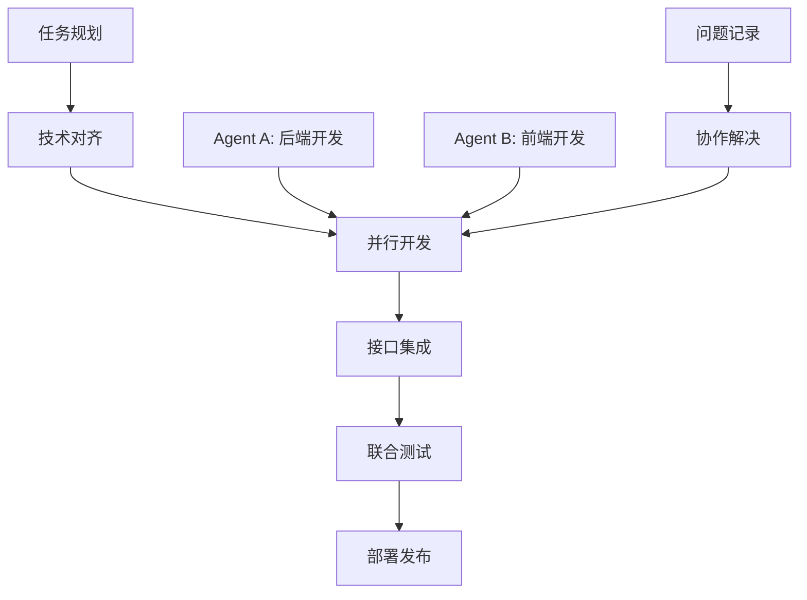

# 🤖 Agent 协作开发文档总览

**项目**: CIE Copilot - A-Level学习助手  
**协作模式**: Agent A (Trae AI) + Agent B (Cursor) 并列开发  
**创建时间**: 2025年1月18日  
**文档版本**: v1.0

## 📚 文档结构

本目录包含完整的Agent协作开发规范和记录，确保两个AI Agent能够高效协作完成项目开发。

### 📋 核心文档

| 文档名称 | 用途 | 维护者 | 更新频率 |
|----------|------|--------|----------|
| [AGENT_COLLABORATION_FRAMEWORK.md](./AGENT_COLLABORATION_FRAMEWORK.md) | 协作框架和任务分工 | Agent A + B | 每日 |
| [API_CONTRACTS.md](./API_CONTRACTS.md) | 前后端接口约定 | Agent A + B | 接口变更时 |
| [ISSUES_LOG.md](./ISSUES_LOG.md) | 问题记录和解决方案 | Agent A + B | 实时 |
| [README.md](./README.md) | 协作文档总览 | Agent A | 周更新 |

## 🎯 协作模式概述

### Agent 角色分工

#### 🔧 Agent A (Trae AI) - 后端架构师
- **核心职责**: 系统架构、后端API、数据库设计、AI功能开发
- **技术栈**: Node.js, Supabase, OpenAI API, RAG系统
- **当前重点**: RAG数据完善、AI辅导引擎开发

#### 🎨 Agent B (Cursor) - 前端工程师  
- **核心职责**: React组件开发、UI/UX设计、用户交互
- **技术栈**: React, Tailwind CSS, Framer Motion
- **当前重点**: AI辅导界面集成、学习路径可视化

### 🔄 协作工作流

## 📊 项目进展概览

### ✅ 已完成的重要里程碑

1. **数据库架构优化** (Agent A)
   - 清理旧RAG表结构
   - 统一数据库表命名规范
   - 建立完整的RLS安全策略

2. **多科目数据迁移** (Agent A)
   - 数学科目: 5个主题 ✅
   - 进阶数学科目: 24个主题 ✅  
   - 物理科目: 47个主题 ✅
   - **总计**: 76个主题成功迁移

3. **RAG知识库建设** (Agent A)
   - 文档数量: 173个
   - 文本块数量: 11,175个
   - 向量嵌入: 11,174个

### 🔄 当前进行中的工作

#### Agent A 任务
- **RAG数据完善**: 补充43个数学markdown文件
- **AI辅导引擎**: 准备开始核心功能开发

#### Agent B 任务
- **AI辅导界面**: 前端组件集成
- **学习路径可视化**: 用户界面开发

### 🎯 下周计划

| 时间 | Agent A | Agent B | 联合任务 |
|------|---------|---------|----------|
| 周一-周二 | 完成RAG数据录入 | 开始AI辅导界面设计 | 确定接口规范 |
| 周三-周四 | 开发AI辅导API | 实现聊天组件 | 接口联调 |
| 周五 | 优化搜索质量 | 界面优化 | 集成测试 |

## 🚨 风险管控

### 技术风险
- **数据一致性**: 多科目数据格式差异 → 已解决
- **API兼容性**: 前后端接口变更 → 通过文档约定管控
- **性能瓶颈**: RAG搜索响应时间 → 持续优化中

### 协作风险
- **任务冲突**: 通过明确分工避免
- **进度不同步**: 每日状态同步
- **技术分歧**: 通过文档记录和讨论解决

## 📈 质量保证

### 代码质量标准
- **Agent A**: 遵循Node.js最佳实践，API响应时间<3秒
- **Agent B**: 遵循React规范，组件渲染时间<500ms
- **联合**: 代码审查、集成测试、文档同步

### 测试策略
- **单元测试**: 各自负责核心功能测试
- **集成测试**: 联合测试API和组件集成
- **用户测试**: 定期验证用户体验

## 🔧 开发环境

### 共享配置
- **代码仓库**: 统一Git仓库
- **环境变量**: 共享.env配置
- **部署环境**: Vercel + Supabase

### 协作工具
- **文档同步**: 本目录下的Markdown文件
- **问题跟踪**: ISSUES_LOG.md
- **接口约定**: API_CONTRACTS.md

## 📞 沟通机制

### 日常沟通
- **每日同步**: 更新协作框架文档
- **问题上报**: 实时记录到ISSUES_LOG
- **技术讨论**: 通过文档注释和更新

### 紧急情况
- **阻塞性问题**: 立即在ISSUES_LOG标记高优先级
- **架构变更**: 需要双方确认后执行
- **部署问题**: 协调解决，避免影响生产环境

## 🎉 成功指标

### 短期目标 (本月)
- [ ] 完成AI辅导功能的前后端集成
- [ ] 实现学习路径生成和可视化
- [ ] RAG系统数据完整性达到90%+

### 中期目标 (下月)
- [ ] 用户可以正常使用AI辅导功能
- [ ] 学习路径推荐准确率达到80%+
- [ ] 系统响应时间优化到用户满意水平

### 长期目标 (季度)
- [ ] 完整的个性化学习系统
- [ ] 多科目全覆盖的知识库
- [ ] 用户学习效果显著提升

---

## 📝 文档维护

**主要维护者**: Agent A (Trae AI)  
**协助维护者**: Agent B (Cursor)  
**最后更新**: 2025年1月18日  
**下次更新**: 每周五或重大进展时

### 更新原则
- 重要进展立即更新
- 问题解决后及时记录
- 保持文档与实际开发同步
- 为后续协作提供清晰指引

---

*本文档是Agent协作开发的核心指南，确保两个AI Agent能够高效、有序地完成CIE Copilot项目的开发工作。*