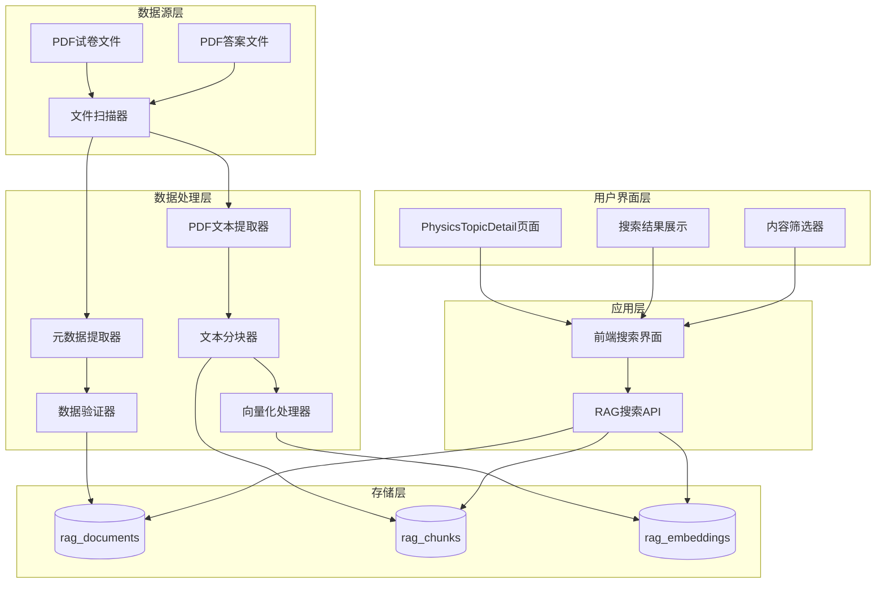
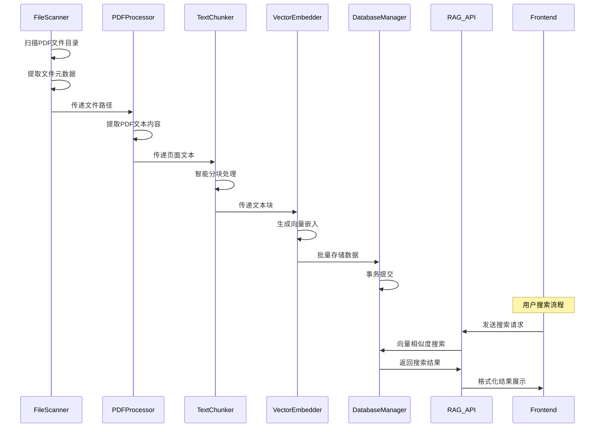

# 真题试卷和标准答案系统化迁移 - 架构设计文档

## 🏗️ 整体架构设计

### 系统架构图


## 📋 核心组件设计

### 1. 文件扫描与元数据提取模块

#### 组件职责
- 递归扫描past-papers和mark-schemes目录
- 从文件路径和文件名提取结构化元数据
- 验证文件完整性和可读性

#### 接口设计
```javascript
class FileScanner {
  // 扫描指定目录的PDF文件
  async scanDirectory(baseDir, options = {}) {
    // 返回: Array<FileMetadata>
  }
  
  // 从文件路径提取元数据
  extractMetadata(filePath) {
    // 返回: FileMetadata
  }
  
  // 验证文件可读性
  async validateFile(filePath) {
    // 返回: ValidationResult
  }
}

// 数据结构
interface FileMetadata {
  filePath: string;
  fileName: string;
  subjectCode: string;     // '9702'
  paperCode: string;       // '9702_s23_qp_12'
  sourceType: string;      // 'past_paper_pdf' | 'mark_scheme_pdf'
  year: number;           // 2023
  session: string;        // 'summer' | 'winter' | 'march'
  paperNumber: number;    // 1-5
  variant: number;        // 1-3
  fileSize: number;
  lastModified: Date;
}
```

### 2. PDF处理与文本提取模块

#### 组件职责
- 提取PDF文本内容
- 处理数学公式和特殊符号
- 按页面组织文本内容
- 质量检查和错误处理

#### 接口设计
```javascript
class PDFProcessor {
  // 提取PDF文本内容
  async extractText(filePath) {
    // 返回: Array<PageContent>
  }
  
  // 文本质量检查
  validateTextQuality(text) {
    // 返回: QualityReport
  }
  
  // 清理和标准化文本
  normalizeText(text) {
    // 返回: string
  }
}

// 数据结构
interface PageContent {
  pageNumber: number;
  text: string;
  confidence: number;  // 文本提取置信度
  hasFormulas: boolean;
  hasImages: boolean;
}

interface QualityReport {
  isValid: boolean;
  confidence: number;
  issues: Array<string>;
  wordCount: number;
  hasContent: boolean;
}
```

### 3. 文本分块与向量化模块

#### 组件职责
- 将长文本分割为合适的块
- 保持上下文完整性
- 生成文本向量嵌入
- 批量处理优化

#### 接口设计
```javascript
class TextChunker {
  // 文本分块
  chunkText(text, options = {}) {
    // 返回: Array<TextChunk>
  }
  
  // 智能分块(保持问题完整性)
  smartChunk(text, options = {}) {
    // 返回: Array<TextChunk>
  }
}

class VectorEmbedder {
  // 批量向量化
  async embedBatch(texts) {
    // 返回: Array<number[]>
  }
  
  // 单个文本向量化
  async embedSingle(text) {
    // 返回: number[]
  }
}

// 数据结构
interface TextChunk {
  content: string;
  tokenCount: number;
  pageFrom: number;
  pageTo: number;
  chunkIndex: number;
  contextType: 'question' | 'answer' | 'explanation' | 'general';
}
```

### 4. 数据库操作模块

#### 组件职责
- 文档、分块、向量的CRUD操作
- 批量插入优化
- 事务管理
- 数据一致性保证

#### 接口设计
```javascript
class DatabaseManager {
  // 批量插入文档
  async batchInsertDocuments(documents) {
    // 返回: Array<DocumentRecord>
  }
  
  // 批量插入分块和向量
  async batchInsertChunksAndEmbeddings(chunks, embeddings) {
    // 返回: BatchInsertResult
  }
  
  // 检查重复文档
  async checkDuplicates(paperCode, sourceType) {
    // 返回: boolean
  }
  
  // 事务处理
  async executeTransaction(operations) {
    // 返回: TransactionResult
  }
}
```

## 🔄 数据流向设计

### 数据流向图


## 🎯 接口契约定义

### 1. RAG搜索API扩展

#### 搜索请求接口
```javascript
// POST /api/rag/search
{
  query: string,
  subject: string,        // '9702'
  filters: {
    contentType?: 'notes' | 'past_paper' | 'mark_scheme' | 'all',
    year?: number,
    session?: 'summer' | 'winter' | 'march',
    paperNumber?: number,
    limit?: number
  },
  options: {
    includeMetadata: boolean,
    highlightMatches: boolean
  }
}
```

#### 搜索响应接口
```javascript
{
  success: boolean,
  results: Array<{
    id: string,
    content: string,
    similarity: number,
    metadata: {
      sourceType: string,
      paperCode: string,
      title: string,
      year: number,
      session: string,
      paperNumber: number,
      pageFrom: number,
      pageTo: number
    },
    highlights?: Array<string>
  }>,
  total: number,
  processingTime: number,
  filters: object
}
```

### 2. 前端组件接口

#### 搜索组件Props
```javascript
interface SearchComponentProps {
  onSearch: (query: string, filters: SearchFilters) => void;
  onFilterChange: (filters: SearchFilters) => void;
  loading: boolean;
  placeholder?: string;
  defaultFilters?: SearchFilters;
}

interface SearchFilters {
  contentType: ContentType;
  year?: number;
  session?: Session;
  paperNumber?: number;
}
```

#### 结果展示组件Props
```javascript
interface SearchResultsProps {
  results: SearchResult[];
  loading: boolean;
  onResultClick: (result: SearchResult) => void;
  onLoadMore?: () => void;
  hasMore?: boolean;
}
```

## 🔧 技术实现细节

### 1. 文件命名规范解析
```javascript
// 解析规则
const FILENAME_PATTERNS = {
  pastPaper: /^(\d{4})_([smw])(\d{2})_qp_(\d)(\d)\.pdf$/,
  markScheme: /^(\d{4})_([smw])(\d{2})_ms_(\d)(\d)\.pdf$/
};

// 示例: 9702_s23_qp_12.pdf
// 匹配: ["9702_s23_qp_12.pdf", "9702", "s", "23", "1", "2"]
```

### 2. 智能分块策略
```javascript
const CHUNKING_CONFIG = {
  targetTokens: 500,
  overlapTokens: 60,
  preserveQuestions: true,  // 保持问题完整性
  splitOnSections: true,    // 按章节分割
  minChunkSize: 100,       // 最小块大小
  maxChunkSize: 800        // 最大块大小
};
```

### 3. 向量化配置
```javascript
const EMBEDDING_CONFIG = {
  model: 'text-embedding-3-small',
  dimensions: 1536,
  batchSize: 100,          // 批量处理大小
  retryAttempts: 3,        // 重试次数
  rateLimitDelay: 1000     // 速率限制延迟
};
```

## 🛡️ 异常处理策略

### 1. 文件处理异常
- PDF损坏或无法读取 → 记录错误日志，跳过文件
- 文本提取质量低 → 标记为低质量，但仍然处理
- 文件权限问题 → 记录错误，提供修复建议

### 2. API调用异常
- 向量化API失败 → 重试机制，降级处理
- 数据库连接失败 → 事务回滚，保持数据一致性
- 速率限制 → 自动延迟，批量优化

### 3. 数据一致性保证
- 使用数据库事务确保原子性
- 实施检查点机制支持断点续传
- 提供数据验证和修复工具

## 📊 性能优化设计

### 1. 批量处理优化
- 文件批量扫描和处理
- 向量化API批量调用
- 数据库批量插入操作

### 2. 内存管理
- 流式处理大文件
- 及时释放处理完的数据
- 监控内存使用情况

### 3. 并发控制
- 限制并发文件处理数量
- API调用速率控制
- 数据库连接池管理

---

**设计状态**: ✅ 架构设计完成
**复杂度评估**: 中等 (复用现有组件，扩展功能)
**预估工期**: 3-5天
**下一步**: 原子化任务拆分