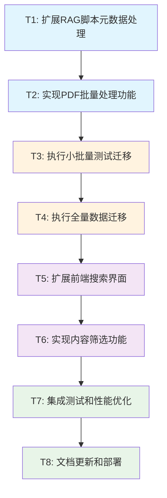

# 真题试卷和标准答案系统化迁移 - 任务分解文档

## 🎯 任务依赖关系图

## 📋 原子任务详细定义

### T1: 扩展RAG脚本元数据处理

#### 输入契约
- **前置依赖**: 现有rag_ingest.js脚本
- **输入数据**: PDF文件路径和文件名
- **环境依赖**: Node.js环境，现有依赖包

#### 输出契约
- **输出数据**: 增强的元数据提取功能
- **交付物**: 更新的rag_ingest.js文件
- **验收标准**: 
  - [ ] 能正确解析试卷文件名格式 (9702_s23_qp_12.pdf)
  - [ ] 能正确解析答案文件名格式 (9702_s23_ms_12.pdf)
  - [ ] 提取年份、考试季、试卷号、变体号信息
  - [ ] 区分past_paper_pdf和mark_scheme_pdf类型
  - [ ] 包含错误处理和日志记录

#### 实现约束
- **技术栈**: JavaScript/Node.js
- **接口规范**: 保持现有函数签名兼容
- **质量要求**: 单元测试覆盖率>80%

#### 依赖关系
- **后置任务**: T2
- **并行任务**: 无

---

### T2: 实现PDF批量处理功能

#### 输入契约
- **前置依赖**: T1完成的元数据处理功能
- **输入数据**: past-papers和mark-schemes目录路径
- **环境依赖**: PDF文件可读，OpenAI API密钥配置

#### 输出契约
- **输出数据**: 批量处理和进度监控功能
- **交付物**: 增强的批量处理逻辑
- **验收标准**:
  - [ ] 支持递归扫描多级目录
  - [ ] 实现批量处理进度显示
  - [ ] 支持断点续传功能
  - [ ] 包含错误恢复机制
  - [ ] 支持dry-run模式验证
  - [ ] 处理速度>10个PDF/分钟

#### 实现约束
- **技术栈**: 基于现有rag_ingest.js架构
- **接口规范**: 命令行参数兼容现有格式
- **质量要求**: 内存使用<500MB，支持大文件处理

#### 依赖关系
- **前置任务**: T1
- **后置任务**: T3
- **并行任务**: 无

---

### T3: 执行小批量测试迁移

#### 输入契约
- **前置依赖**: T2完成的批量处理功能
- **输入数据**: 选定的10个PDF文件(5个试卷+5个答案)
- **环境依赖**: Supabase数据库连接，OpenAI API可用

#### 输出契约
- **输出数据**: 测试数据成功导入RAG数据库
- **交付物**: 测试报告和质量验证结果
- **验收标准**:
  - [ ] 10个PDF文件100%成功处理
  - [ ] 文本提取质量>90%
  - [ ] 向量嵌入成功生成
  - [ ] 数据库记录正确创建
  - [ ] 搜索功能正常工作
  - [ ] 处理时间<30分钟

#### 实现约束
- **技术栈**: 使用T2完成的脚本
- **接口规范**: 标准命令行执行
- **质量要求**: 零数据丢失，完整错误日志

#### 依赖关系
- **前置任务**: T2
- **后置任务**: T4
- **并行任务**: 无

---

### T4: 执行全量数据迁移

#### 输入契约
- **前置依赖**: T3测试验证通过
- **输入数据**: 所有物理9702 PDF文件(~200-300个)
- **环境依赖**: 稳定网络连接，充足API配额

#### 输出契约
- **输出数据**: 完整的物理试卷数据库
- **交付物**: 迁移完成报告和数据统计
- **验收标准**:
  - [ ] 所有PDF文件处理完成(成功率>95%)
  - [ ] 数据库包含完整的试卷和答案内容
  - [ ] 元数据正确关联
  - [ ] 向量搜索功能验证通过
  - [ ] 数据完整性检查通过
  - [ ] 生成详细的处理报告

#### 实现约束
- **技术栈**: 经过T3验证的处理脚本
- **接口规范**: 分批执行，监控进度
- **质量要求**: 支持中断恢复，完整日志记录

#### 依赖关系
- **前置任务**: T3
- **后置任务**: T5
- **并行任务**: 无

---

### T5: 扩展前端搜索界面

#### 输入契约
- **前置依赖**: T4完成的数据迁移
- **输入数据**: 现有PhysicsTopicDetail.jsx组件
- **环境依赖**: React开发环境，现有RAG API

#### 输出契约
- **输出数据**: 增强的搜索界面组件
- **交付物**: 更新的PhysicsTopicDetail.jsx文件
- **验收标准**:
  - [ ] 搜索结果显示内容类型标识
  - [ ] 支持试卷和答案内容搜索
  - [ ] 搜索结果包含年份和考试季信息
  - [ ] 保持现有搜索功能不受影响
  - [ ] UI响应式设计适配
  - [ ] 搜索性能<2秒响应

#### 实现约束
- **技术栈**: React, React Query, 现有UI组件库
- **接口规范**: 保持现有API接口兼容
- **质量要求**: 组件可复用，代码符合项目规范

#### 依赖关系
- **前置任务**: T4
- **后置任务**: T6
- **并行任务**: 无

---

### T6: 实现内容筛选功能

#### 输入契约
- **前置依赖**: T5完成的搜索界面
- **输入数据**: 搜索结果数据结构
- **环境依赖**: 前端开发环境，UI组件库

#### 输出契约
- **输出数据**: 完整的筛选和过滤功能
- **交付物**: 筛选组件和集成代码
- **验收标准**:
  - [ ] 按内容类型筛选(笔记/试卷/答案)
  - [ ] 按年份筛选(2016-2024)
  - [ ] 按考试季筛选(夏季/冬季/三月)
  - [ ] 按试卷类型筛选(Paper 1-5)
  - [ ] 筛选条件可组合使用
  - [ ] 筛选状态持久化
  - [ ] 清除筛选功能

#### 实现约束
- **技术栈**: React组件，状态管理
- **接口规范**: RESTful API筛选参数
- **质量要求**: 用户体验流畅，筛选逻辑准确

#### 依赖关系
- **前置任务**: T5
- **后置任务**: T7
- **并行任务**: 无

---

### T7: 集成测试和性能优化

#### 输入契约
- **前置依赖**: T6完成的完整功能
- **输入数据**: 完整的应用系统
- **环境依赖**: 测试环境，性能监控工具

#### 输出契约
- **输出数据**: 优化后的系统性能
- **交付物**: 测试报告和性能优化方案
- **验收标准**:
  - [ ] 端到端功能测试通过
  - [ ] 搜索响应时间<2秒
  - [ ] 并发用户支持>50
  - [ ] 内存使用稳定
  - [ ] 错误处理覆盖完整
  - [ ] 用户体验测试通过
  - [ ] 性能基准测试通过

#### 实现约束
- **技术栈**: 测试框架，性能监控工具
- **接口规范**: 符合生产环境要求
- **质量要求**: 系统稳定性>99.9%

#### 依赖关系
- **前置任务**: T6
- **后置任务**: T8
- **并行任务**: 无

---

### T8: 文档更新和部署

#### 输入契约
- **前置依赖**: T7完成的系统优化
- **输入数据**: 完整的功能系统
- **环境依赖**: 文档系统，部署环境

#### 输出契约
- **输出数据**: 完整的项目文档和部署
- **交付物**: 更新的文档和部署指南
- **验收标准**:
  - [ ] API文档更新完整
  - [ ] 用户使用指南更新
  - [ ] 开发者文档更新
  - [ ] 部署脚本验证
  - [ ] 生产环境部署成功
  - [ ] 用户培训材料准备
  - [ ] 监控和告警配置

#### 实现约束
- **技术栈**: Markdown文档，部署工具
- **接口规范**: 标准文档格式
- **质量要求**: 文档准确性100%，部署成功率100%

#### 依赖关系
- **前置任务**: T7
- **后置任务**: 无
- **并行任务**: 无

## 📊 任务复杂度评估

| 任务ID | 任务名称 | 复杂度 | 预估工时 | 风险等级 |
|--------|----------|--------|----------|----------|
| T1 | 扩展RAG脚本元数据处理 | 中等 | 4-6小时 | 低 |
| T2 | 实现PDF批量处理功能 | 中等 | 6-8小时 | 中 |
| T3 | 执行小批量测试迁移 | 简单 | 2-3小时 | 低 |
| T4 | 执行全量数据迁移 | 简单 | 4-6小时 | 中 |
| T5 | 扩展前端搜索界面 | 中等 | 6-8小时 | 低 |
| T6 | 实现内容筛选功能 | 中等 | 4-6小时 | 低 |
| T7 | 集成测试和性能优化 | 高 | 8-10小时 | 中 |
| T8 | 文档更新和部署 | 简单 | 3-4小时 | 低 |

**总预估工时**: 37-51小时 (约5-7个工作日)

## 🎯 关键成功因素

### 技术风险缓解
- **PDF质量问题**: 实施质量检查和人工验证
- **API限制**: 分批处理和速率控制
- **性能问题**: 渐进式优化和监控

### 质量保证措施
- **代码审查**: 每个任务完成后进行代码审查
- **测试验证**: 每个阶段包含验收测试
- **文档同步**: 代码变更同时更新文档

### 进度监控
- **每日检查点**: 跟踪任务进度和阻塞问题
- **质量门控**: 每个任务必须通过验收标准
- **风险预警**: 及时识别和处理风险问题

---

**任务分解状态**: ✅ 原子化完成
**总体复杂度**: 中等
**执行策略**: 顺序执行，质量优先
**下一步**: 进入Approve阶段进行最终审查