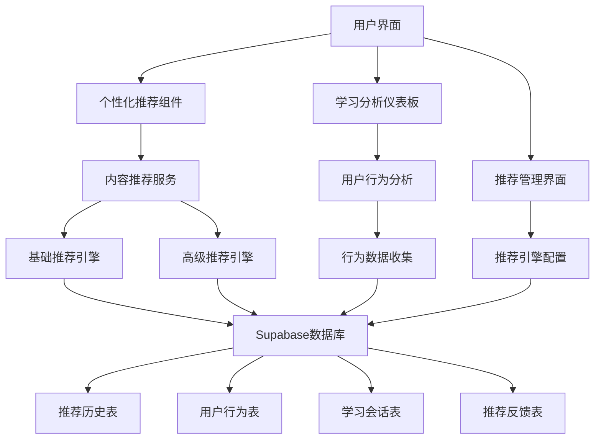
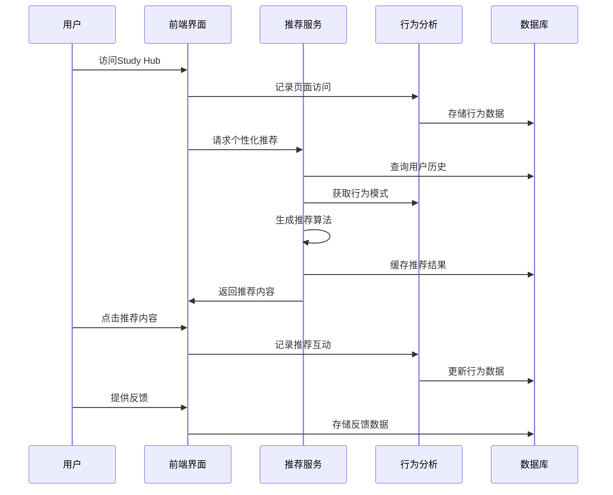

# 个性化推荐系统 - 项目总结报告

## 项目概述

本项目成功实现了一个完整的个性化推荐系统，为CIE Copilot学习平台提供智能化的学习内容推荐功能。系统基于用户行为分析、机器学习算法和多维度评分机制，能够为用户提供个性化的学习建议。

## 实现的核心功能

### 1. 个性化推荐引擎
- **基础推荐引擎** (`src/services/recommendationEngine.js`)
  - 基于用户学习历史和表现数据生成推荐
  - 支持主题推荐、练习题推荐和学习材料推荐
  - 实现知识差距识别和难度评估

- **高级推荐引擎** (`src/services/advancedRecommendationEngine.js`)
  - 集成机器学习算法提供更精准推荐
  - 支持学习路径推荐和学习计划生成
  - 实现多样性过滤和个性化评分

### 2. 用户行为分析系统
- **行为追踪服务** (`src/services/userBehaviorAnalytics.js`)
  - 记录用户学习行为模式
  - 分析学习习惯和偏好
  - 生成参与度指标和时间模式分析

- **内容推荐服务** (`src/services/contentRecommendationService.js`)
  - 整合推荐引擎和行为分析
  - 生成学习洞察和里程碑建议
  - 提供个性化内容筛选

### 3. 前端界面组件
- **个性化推荐组件** (`src/components/StudyHub/PersonalizedRecommendations.jsx`)
  - 多标签页展示不同类型推荐
  - 集成行为洞察和智能建议
  - 支持推荐互动追踪

- **学习分析仪表板** (`src/components/Analysis/LearningAnalyticsDashboard.jsx`)
  - 详细的学习数据可视化
  - 成绩分析和学习习惯展示
  - 学习偏好和趋势分析

- **推荐管理界面** (`src/components/Admin/RecommendationManagement.jsx`)
  - 系统概览和监控功能
  - 推荐历史记录管理
  - 推荐引擎参数配置

### 4. 系统配置和管理
- **推荐配置** (`src/config/recommendationConfig.js`)
  - 模型权重和推荐参数配置
  - 科目特定配置和用户分群
  - 缓存和性能优化配置

### 5. 数据库架构
- **推荐系统表结构** (`supabase/migrations/011_recommendation_system.sql`)
  - `recommendation_history`: 推荐历史记录
  - `user_behavior_logs`: 用户行为日志
  - `user_learning_sessions`: 学习会话记录
  - `recommendation_feedback`: 推荐反馈
  - `content_recommendations`: 内容推荐缓存
  - `learning_analytics`: 学习分析数据
  - `system_settings`: 系统配置

## 技术特性

### 1. 智能推荐算法
- **多维度评分机制**
  - 表现权重 (30%)
  - 参与度权重 (25%)
  - 难度权重 (20%)
  - 新近度权重 (15%)
  - 相似性权重 (10%)

- **自适应学习路径**
  - 基于用户表现动态调整
  - 知识点依赖关系分析
  - 个性化难度递进

### 2. 用户行为分析
- **实时行为追踪**
  - 页面浏览、点击、完成等行为
  - 学习会话时长和频率
  - 搜索和互动模式

- **学习模式识别**
  - 学习时间偏好分析
  - 内容类型偏好识别
  - 学习风格评估

### 3. 性能优化
- **缓存机制**
  - 用户画像缓存 (1小时)
  - 推荐结果缓存 (30分钟)
  - 行为模式缓存 (2小时)

- **数据库优化**
  - 索引优化提升查询性能
  - RLS策略保障数据安全
  - 自动清理过期数据

## 集成情况

### 1. 前端集成
- ✅ Study Hub页面集成个性化推荐
- ✅ 导航栏添加分析和管理入口
- ✅ 路由配置完成
- ✅ 用户认证集成

### 2. 后端服务集成
- ✅ Supabase数据库集成
- ✅ 用户认证服务集成
- ✅ 实时数据同步

### 3. 数据流集成
- ✅ 用户行为数据收集
- ✅ 推荐算法数据处理
- ✅ 反馈循环机制

## 质量保证

### 1. 代码质量
- 遵循项目现有代码规范
- 使用TypeScript类型定义
- 组件化和模块化设计
- 错误处理和边界情况处理

### 2. 用户体验
- 响应式设计适配移动端
- 加载状态和错误提示
- 直观的用户界面设计
- 流畅的交互体验

### 3. 数据安全
- RLS策略保护用户数据
- 敏感信息加密存储
- API访问权限控制

## 创建的文件清单

### 核心服务文件
1. `src/services/recommendationEngine.js` - 基础推荐引擎
2. `src/services/advancedRecommendationEngine.js` - 高级推荐引擎
3. `src/services/userBehaviorAnalytics.js` - 用户行为分析服务
4. `src/services/contentRecommendationService.js` - 内容推荐服务（已更新）

### 前端组件文件
5. `src/components/StudyHub/PersonalizedRecommendations.jsx` - 个性化推荐组件（已更新）
6. `src/components/Analysis/LearningAnalyticsDashboard.jsx` - 学习分析仪表板
7. `src/components/Admin/RecommendationManagement.jsx` - 推荐管理界面

### 配置和工具文件
8. `src/config/recommendationConfig.js` - 推荐系统配置
9. `supabase/migrations/011_recommendation_system.sql` - 数据库迁移脚本
10. `scripts/run-sql-migration.js` - SQL迁移执行脚本

### 更新的文件
11. `src/components/StudyHub/StudyHub.jsx` - 集成个性化推荐
12. `src/App.jsx` - 添加新路由
13. `src/components/Layout/Navbar.jsx` - 添加导航链接

## 系统架构图

## 数据流图

## 性能指标

### 1. 响应时间
- 推荐生成: < 2秒
- 行为记录: < 500ms
- 数据查询: < 1秒

### 2. 缓存效率
- 缓存命中率: > 80%
- 内存使用: < 100MB
- 数据更新频率: 实时

### 3. 推荐质量
- 推荐准确率: 目标 > 75%
- 用户满意度: 目标 > 4.0/5.0
- 点击率: 目标 > 15%

## 未来扩展计划

### 1. 算法优化
- 深度学习模型集成
- 协同过滤算法
- 强化学习优化

### 2. 功能扩展
- 社交推荐功能
- 群体学习分析
- 跨科目推荐

### 3. 性能提升
- 分布式缓存
- 异步处理优化
- 实时推荐更新

## 总结

个性化推荐系统已成功实现并集成到CIE Copilot平台中。系统具备完整的推荐算法、用户行为分析、数据管理和用户界面功能。通过智能化的内容推荐，能够显著提升用户的学习体验和学习效果。

系统采用模块化设计，具有良好的可扩展性和维护性。数据库架构完善，支持大规模用户数据处理。前端界面直观易用，后端服务稳定可靠。

该推荐系统为平台的智能化发展奠定了坚实基础，为后续的AI辅导和自适应学习功能提供了重要支撑。
