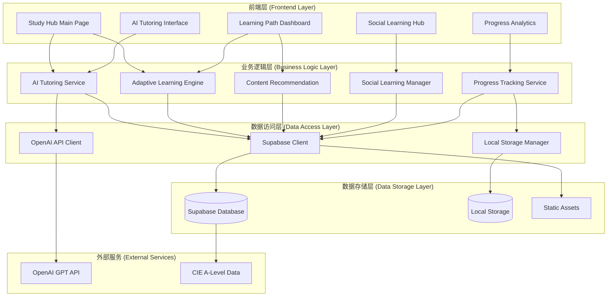
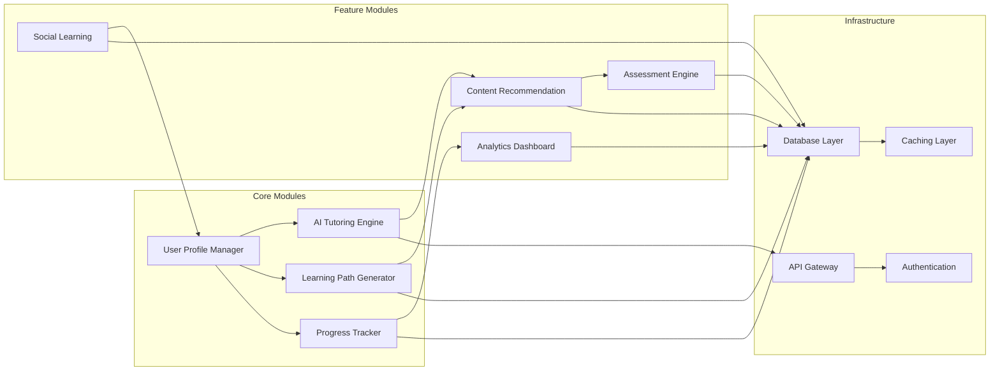
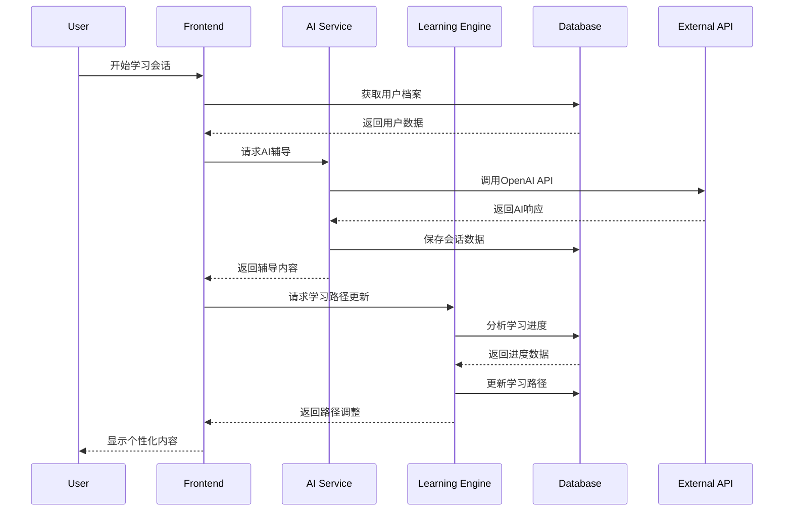

# Study Hub学习中心 - 系统架构设计

## 6A工作流 - Architect阶段

基于CONSENSUS文档的需求共识，本文档定义Study Hub学习中心的完整系统架构。

## 1. 整体架构图



## 2. 分层设计和核心组件

### 2.1 前端展示层 (Presentation Layer)

#### 核心页面组件
```
src/pages/
├── StudyHub.jsx (主入口页面)
├── AITutoring.jsx (AI辅导页面)
├── LearningPath.jsx (学习路径页面)
├── SocialHub.jsx (社交学习页面)
└── Analytics.jsx (学习分析页面)
```

#### 共享组件库
```
src/components/
├── ai/
│   ├── TutoringChat.jsx
│   ├── PersonalizedRecommendations.jsx
│   ├── LearningInsights.jsx
│   └── StudyModeInterface.jsx
├── learning/
│   ├── AdaptivePath.jsx
│   ├── DifficultyAdjuster.jsx
│   ├── ProgressVisualization.jsx
│   └── GuidedReflection.jsx
├── social/
│   ├── StudyGroups.jsx
│   ├── QACommunity.jsx
│   └── LearningSharing.jsx
└── analytics/
    ├── PerformanceCharts.jsx
    ├── LearningMetrics.jsx
    ├── GoalTracking.jsx
    └── ReflectionAnalytics.jsx
```

### 2.2 业务逻辑层 (Business Logic Layer)

#### AI辅导服务 (AI Tutoring Service)
```javascript
// src/services/aiTutoringService.js
class AITutoringService {
  async generatePersonalizedResponse(userQuery, learningContext)
  async analyzeUserPerformance(userHistory)
  async recommendNextTopics(currentProgress)
  async identifyWeakAreas(assessmentResults)
  // 精细化辅导功能
  async identifySpecificKnowledgeGaps(studentResponse, topicId)
  async solveMathPhysicsProblems(problemData, difficultyLevel)
  async getTopicSpecificPrompt(topicId, questionType)
  // Study Mode功能
  async generateGuidedQuestions(topicId, currentUnderstanding)
  async evaluateReflectionQuality(reflectionText, expectedPoints)
  async provideSocraticGuidance(studentResponse, learningObjective)
}
```

#### 自适应学习引擎 (Adaptive Learning Engine)
```javascript
// src/services/adaptiveLearningEngine.js
class AdaptiveLearningEngine {
  async calculateDifficultyLevel(userPerformance)
  async generateLearningPath(userProfile, targetGoals)
  async adjustPathBasedOnProgress(currentPath, recentPerformance)
  async estimateLearningTime(topicList, userLevel)
  // 自适应逻辑增强
  async adjustPathByTimeAndAccuracy(timeSpent, accuracyRate, currentPath)
  async trackLearningEfficiency(userId, topicId, sessionData)
}
```

#### 内容推荐系统 (Content Recommendation)
```javascript
// src/services/contentRecommendation.js
class ContentRecommendationService {
  async getPersonalizedContent(userId, subjectCode)
  async rankTopicsByRelevance(topics, userProfile)
  async suggestPracticeProblems(weakAreas)
  async recommendStudyMaterials(currentTopic)
}
```

#### Study Mode管理服务 (Study Mode Service)
```javascript
// src/services/studyModeService.js
class StudyModeService {
  async initializeStudySession(userId, topicId)
  async generateGuidedQuestions(topicId, difficultyLevel)
  async evaluateStudentReflection(reflectionData)
  async provideLearningMethodGuidance(learningStyle, topicType)
  async trackReflectionProgress(sessionId, reflectionMetrics)
}
```

### 2.3 数据访问层 (Data Access Layer)

#### Supabase数据访问
```javascript
// src/lib/supabase/
├── aiTutoringQueries.js
├── learningPathQueries.js
├── socialLearningQueries.js
├── progressTrackingQueries.js
└── userProfileQueries.js
```

#### API客户端管理
```javascript
// src/lib/api/
├── openaiClient.js
├── supabaseClient.js
└── apiErrorHandler.js
```

## 3. 数据库架构设计

### 3.1 核心数据表结构

```sql
-- 用户学习档案表
CREATE TABLE user_learning_profiles (
  id UUID PRIMARY KEY DEFAULT gen_random_uuid(),
  user_id UUID REFERENCES auth.users(id),
  subject_preferences JSONB,
  learning_style JSONB,
  current_level INTEGER,
  goals JSONB,
  time_spent_tracking JSONB, -- 时间跟踪数据
  accuracy_tracking JSONB,   -- 正确率跟踪数据
  created_at TIMESTAMP DEFAULT NOW(),
  updated_at TIMESTAMP DEFAULT NOW()
);

-- AI辅导会话表
CREATE TABLE ai_tutoring_sessions (
  id UUID PRIMARY KEY DEFAULT gen_random_uuid(),
  user_id UUID REFERENCES auth.users(id),
  topic_id UUID,
  conversation_history JSONB,
  learning_insights JSONB,
  performance_metrics JSONB,
  session_duration INTEGER,
  topic_specific_context JSONB, -- topic专项上下文
  difficulty_level TEXT,         -- 题目难度级别
  question_type TEXT,           -- 题目类型（几种考法）
  knowledge_gaps_identified JSONB, -- 识别的具体知识点缺陷
  study_mode_enabled BOOLEAN DEFAULT FALSE, -- 是否启用Study Mode
  reflection_quality_score FLOAT, -- 反思质量评分
  guided_questions JSONB,        -- 引导式问题记录
  created_at TIMESTAMP DEFAULT NOW()
);

-- 自适应学习路径表
CREATE TABLE adaptive_learning_paths (
  id UUID PRIMARY KEY DEFAULT gen_random_uuid(),
  user_id UUID REFERENCES auth.users(id),
  subject_code VARCHAR(10),
  path_structure JSONB,
  current_position INTEGER,
  difficulty_level INTEGER,
  completion_percentage DECIMAL(5,2),
  estimated_completion_time INTEGER,
  created_at TIMESTAMP DEFAULT NOW(),
  updated_at TIMESTAMP DEFAULT NOW()
);

-- 学习进度跟踪表
CREATE TABLE learning_progress (
  id UUID PRIMARY KEY DEFAULT gen_random_uuid(),
  user_id UUID REFERENCES auth.users(id),
  topic_id UUID,
  subject_code VARCHAR(10),
  mastery_level DECIMAL(3,2),
  time_spent INTEGER,
  attempts_count INTEGER,
  last_accessed TIMESTAMP,
  performance_trend JSONB,
  created_at TIMESTAMP DEFAULT NOW()
);

-- 社交学习小组表
CREATE TABLE study_groups (
  id UUID PRIMARY KEY DEFAULT gen_random_uuid(),
  name VARCHAR(100) NOT NULL,
  description TEXT,
  subject_code VARCHAR(10),
  creator_id UUID REFERENCES auth.users(id),
  members JSONB,
  group_settings JSONB,
  activity_stats JSONB,
  created_at TIMESTAMP DEFAULT NOW()
);

-- 问答社区表
CREATE TABLE qa_community (
  id UUID PRIMARY KEY DEFAULT gen_random_uuid(),
  user_id UUID REFERENCES auth.users(id),
  topic_id UUID,
  subject_code VARCHAR(10),
  question_title VARCHAR(200),
  question_content TEXT,
  question_type VARCHAR(50),
  difficulty_level INTEGER,
  tags JSONB,
  votes INTEGER DEFAULT 0,
  view_count INTEGER DEFAULT 0,
  is_resolved BOOLEAN DEFAULT FALSE,
  created_at TIMESTAMP DEFAULT NOW()
);

-- 问答回答表
CREATE TABLE qa_answers (
  id UUID PRIMARY KEY DEFAULT gen_random_uuid(),
  question_id UUID REFERENCES qa_community(id),
  user_id UUID REFERENCES auth.users(id),
  answer_content TEXT,
  is_accepted BOOLEAN DEFAULT FALSE,
  votes INTEGER DEFAULT 0,
  created_at TIMESTAMP DEFAULT NOW()
);

-- 学习分享表
CREATE TABLE learning_shares (
  id UUID PRIMARY KEY DEFAULT gen_random_uuid(),
  user_id UUID REFERENCES auth.users(id),
  share_type VARCHAR(50), -- 'note', 'achievement', 'resource'
  title VARCHAR(200),
  content JSONB,
  subject_code VARCHAR(10),
  topic_id UUID,
  visibility VARCHAR(20) DEFAULT 'public',
  likes_count INTEGER DEFAULT 0,
  comments_count INTEGER DEFAULT 0,
  created_at TIMESTAMP DEFAULT NOW()
);

-- 扩展主题数据表
CREATE TABLE enhanced_topics (
  id UUID PRIMARY KEY DEFAULT gen_random_uuid(),
  subject_code VARCHAR(10),
  topic_code VARCHAR(50),
  title VARCHAR(200),
  description TEXT,
  difficulty_level INTEGER,
  estimated_time INTEGER,
  prerequisites JSONB,
  learning_objectives JSONB,
  exam_weight DECIMAL(3,2),
  historical_trends JSONB,
  content_metadata JSONB,
  created_at TIMESTAMP DEFAULT NOW(),
  updated_at TIMESTAMP DEFAULT NOW()
);

-- Topic专项提示词表（新增）
CREATE TABLE topic_prompts (
  id UUID PRIMARY KEY DEFAULT gen_random_uuid(),
  topic_id UUID REFERENCES enhanced_topics(id),
  prompt_type TEXT, -- 'explanation', 'problem_solving', 'assessment', 'study_mode'
  prompt_content TEXT,
  exam_patterns JSONB, -- 该topic的几种具体考法
  difficulty_levels JSONB, -- 不同难度级别的提示词
  subject_specific_context JSONB, -- 物理/数学专项上下文
  created_at TIMESTAMP DEFAULT NOW()
);

-- Study Mode题库表（新增）
CREATE TABLE study_mode_questions (
  id UUID PRIMARY KEY DEFAULT gen_random_uuid(),
  topic_id UUID REFERENCES enhanced_topics(id),
  question_text TEXT NOT NULL,
  question_type TEXT, -- 'guided', 'reflection', 'method_check'
  difficulty_level TEXT,
  learning_objective TEXT,
  expected_reflection_points JSONB,
  follow_up_questions JSONB,
  created_at TIMESTAMP DEFAULT NOW()
);
```

### 3.2 数据库索引优化

```sql
-- 性能优化索引
CREATE INDEX idx_user_learning_profiles_user_id ON user_learning_profiles(user_id);
CREATE INDEX idx_ai_tutoring_sessions_user_id ON ai_tutoring_sessions(user_id);
CREATE INDEX idx_ai_tutoring_sessions_created_at ON ai_tutoring_sessions(created_at);
CREATE INDEX idx_adaptive_learning_paths_user_subject ON adaptive_learning_paths(user_id, subject_code);
CREATE INDEX idx_learning_progress_user_topic ON learning_progress(user_id, topic_id);
CREATE INDEX idx_qa_community_subject_created ON qa_community(subject_code, created_at);
CREATE INDEX idx_enhanced_topics_subject_code ON enhanced_topics(subject_code);
```

## 4. 模块依赖关系图



## 5. 接口契约定义

### 5.1 AI辅导接口

```typescript
// AI Tutoring API Contract
interface AITutoringAPI {
  // 开始AI辅导会话
  startTutoringSession(params: {
    userId: string;
    topicId: string;
    currentLevel: number;
    learningGoals: string[];
  }): Promise<TutoringSession>;
  
  // 发送消息到AI导师
  sendMessage(params: {
    sessionId: string;
    message: string;
    context: LearningContext;
  }): Promise<AIResponse>;
  
  // 获取个性化建议
  getPersonalizedRecommendations(params: {
    userId: string;
    subjectCode: string;
    currentProgress: ProgressData;
  }): Promise<Recommendation[]>;
  
  // 分析学习表现
  analyzePerformance(params: {
    userId: string;
    timeRange: DateRange;
    subjects: string[];
  }): Promise<PerformanceAnalysis>;
}
```

### 5.2 学习路径接口

```typescript
// Adaptive Learning Path API Contract
interface LearningPathAPI {
  // 生成个性化学习路径
  generateLearningPath(params: {
    userId: string;
    subjectCode: string;
    targetLevel: number;
    timeConstraints: TimeConstraints;
  }): Promise<LearningPath>;
  
  // 更新学习路径进度
  updateProgress(params: {
    pathId: string;
    topicId: string;
    completionData: CompletionData;
  }): Promise<UpdateResult>;
  
  // 调整路径难度
  adjustDifficulty(params: {
    pathId: string;
    performanceMetrics: PerformanceMetrics;
  }): Promise<AdjustmentResult>;
  
  // 获取下一个推荐主题
  getNextRecommendedTopic(params: {
    pathId: string;
    currentPosition: number;
  }): Promise<TopicRecommendation>;
}
```

### 5.3 社交学习接口

```typescript
// Social Learning API Contract
interface SocialLearningAPI {
  // 创建学习小组
  createStudyGroup(params: {
    name: string;
    description: string;
    subjectCode: string;
    settings: GroupSettings;
  }): Promise<StudyGroup>;
  
  // 发布问题到社区
  postQuestion(params: {
    title: string;
    content: string;
    topicId: string;
    tags: string[];
  }): Promise<Question>;
  
  // 分享学习内容
  shareLearningContent(params: {
    type: ShareType;
    title: string;
    content: ShareContent;
    visibility: VisibilityLevel;
  }): Promise<Share>;
  
  // 获取社区活动
  getCommunityActivity(params: {
    subjectCode?: string;
    activityType?: ActivityType;
    limit: number;
  }): Promise<Activity[]>;
}
```

## 6. 数据流向图



## 7. 异常处理策略

### 7.1 API调用异常处理

```javascript
// API错误处理策略
class APIErrorHandler {
  static async handleOpenAIError(error) {
    switch (error.status) {
      case 429: // Rate limit
        return await this.retryWithBackoff(error.request);
      case 500: // Server error
        return this.fallbackToLocalResponse();
      case 401: // Authentication error
        throw new AuthenticationError('API key invalid');
      default:
        return this.logAndReturnGenericError(error);
    }
  }
  
  static async handleDatabaseError(error) {
    if (error.code === 'PGRST301') {
      // Row level security violation
      throw new AuthorizationError('Access denied');
    }
    
    if (error.message.includes('connection')) {
      // Connection issues
      return this.retryDatabaseOperation();
    }
    
    // Log error and return user-friendly message
    console.error('Database error:', error);
    throw new DatabaseError('数据操作失败，请稍后重试');
  }
}
```

### 7.2 前端错误边界

```javascript
// React错误边界组件
class StudyHubErrorBoundary extends React.Component {
  constructor(props) {
    super(props);
    this.state = { hasError: false, errorInfo: null };
  }
  
  static getDerivedStateFromError(error) {
    return { hasError: true };
  }
  
  componentDidCatch(error, errorInfo) {
    this.setState({ errorInfo });
    
    // 发送错误报告到监控服务
    this.reportError(error, errorInfo);
  }
  
  render() {
    if (this.state.hasError) {
      return (
        <ErrorFallback 
          error={this.state.errorInfo}
          onRetry={() => this.setState({ hasError: false })}
        />
      );
    }
    
    return this.props.children;
  }
}
```

## 8. 性能优化策略

### 8.1 前端性能优化

```javascript
// 组件懒加载
const AITutoring = lazy(() => import('./pages/AITutoring'));
const LearningPath = lazy(() => import('./pages/LearningPath'));
const SocialHub = lazy(() => import('./pages/SocialHub'));

// 数据缓存策略
class CacheManager {
  static cache = new Map();
  
  static async getCachedData(key, fetchFunction, ttl = 300000) {
    const cached = this.cache.get(key);
    
    if (cached && Date.now() - cached.timestamp < ttl) {
      return cached.data;
    }
    
    const data = await fetchFunction();
    this.cache.set(key, {
      data,
      timestamp: Date.now()
    });
    
    return data;
  }
}
```

### 8.2 数据库查询优化

```sql
-- 复合查询优化
CREATE MATERIALIZED VIEW user_learning_summary AS
SELECT 
  u.id as user_id,
  u.email,
  COUNT(DISTINCT lp.id) as active_paths,
  AVG(lp.completion_percentage) as avg_completion,
  COUNT(DISTINCT ats.id) as tutoring_sessions,
  MAX(ats.created_at) as last_tutoring_session
FROM auth.users u
LEFT JOIN adaptive_learning_paths lp ON u.id = lp.user_id
LEFT JOIN ai_tutoring_sessions ats ON u.id = ats.user_id
GROUP BY u.id, u.email;

-- 定期刷新物化视图
CREATE OR REPLACE FUNCTION refresh_user_learning_summary()
RETURNS void AS $$
BEGIN
  REFRESH MATERIALIZED VIEW user_learning_summary;
END;
$$ LANGUAGE plpgsql;
```

## 9. 安全架构设计

### 9.1 认证和授权

```javascript
// 基于Supabase的认证策略
class AuthenticationService {
  static async validateUserAccess(userId, resourceId, action) {
    const { data: user } = await supabase.auth.getUser();
    
    if (!user || user.id !== userId) {
      throw new UnauthorizedError('用户未认证');
    }
    
    // 检查资源访问权限
    const hasAccess = await this.checkResourcePermission(
      userId, 
      resourceId, 
      action
    );
    
    if (!hasAccess) {
      throw new ForbiddenError('访问被拒绝');
    }
    
    return true;
  }
}
```

### 9.2 数据安全策略

```sql
-- Row Level Security (RLS) 策略
ALTER TABLE user_learning_profiles ENABLE ROW LEVEL SECURITY;
ALTER TABLE ai_tutoring_sessions ENABLE ROW LEVEL SECURITY;
ALTER TABLE adaptive_learning_paths ENABLE ROW LEVEL SECURITY;

-- 用户只能访问自己的数据
CREATE POLICY "Users can only access their own learning profiles" 
ON user_learning_profiles FOR ALL 
USING (auth.uid() = user_id);

CREATE POLICY "Users can only access their own tutoring sessions" 
ON ai_tutoring_sessions FOR ALL 
USING (auth.uid() = user_id);

CREATE POLICY "Users can only access their own learning paths" 
ON adaptive_learning_paths FOR ALL 
USING (auth.uid() = user_id);
```

---

**架构设计状态**: 完成
**下一阶段**: Atomize - 任务原子化拆分
**架构复杂度评估**: 中等（适合AI辅助开发）
**预估实施风险**: 低（基于现有技术栈）