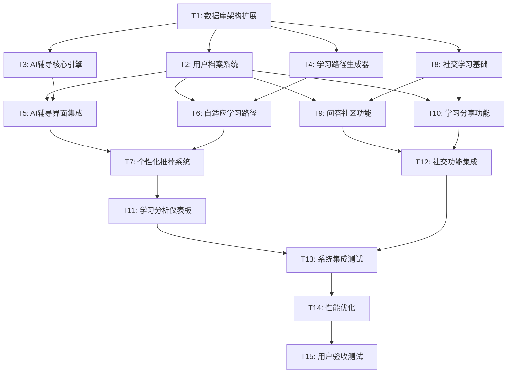

# Study Hub学习中心 - 任务原子化拆分

## 6A工作流 - Atomize阶段

基于DESIGN文档的系统架构，本文档将Study Hub学习中心拆分为可独立执行的原子任务。

## 1. 任务依赖关系图

## 2. 原子任务详细定义

### T1: 数据库架构扩展

**任务描述**: 扩展Supabase数据库，添加Study Hub所需的新表结构

**输入契约**:
- 前置依赖: 现有Supabase数据库访问权限
- 输入数据: DESIGN文档中的数据库架构设计
- 环境依赖: Supabase管理员权限

**输出契约**:
- 输出数据: 完整的数据库表结构和索引
- 交付物: 
  - `database/migrations/001_study_hub_tables.sql`
  - `database/migrations/002_study_hub_indexes.sql`
  - `database/migrations/003_study_hub_rls_policies.sql`
- 验收标准:
  - [ ] 所有表创建成功
  - [ ] 索引创建完成
  - [ ] RLS策略配置正确
  - [ ] 数据库迁移脚本可重复执行

**实现约束**:
- 技术栈: PostgreSQL/Supabase
- 接口规范: 遵循现有数据库命名约定
- 质量要求: 所有迁移必须可回滚

**依赖关系**:
- 后置任务: T2, T3, T4, T8
- 并行任务: 无

**复杂度评估**: 低（2-3小时）

---

### T2: 用户档案系统

**任务描述**: 实现用户学习档案管理系统，包括学习偏好、目标设定和进度跟踪

**输入契约**:
- 前置依赖: T1完成
- 输入数据: 现有用户认证系统
- 环境依赖: React开发环境

**输出契约**:
- 输出数据: 用户档案数据结构和API
- 交付物:
  - `src/services/userProfileService.js`
  - `src/components/profile/UserProfileManager.jsx`
  - `src/lib/supabase/userProfileQueries.js`
  - `src/hooks/useUserProfile.js`
- 验收标准:
  - [ ] 用户可以设置学习偏好
  - [ ] 用户可以设定学习目标
  - [ ] 系统能跟踪用户学习进度
  - [ ] 档案数据持久化存储
  - [ ] 组件可复用且性能良好

**实现约束**:
- 技术栈: React, Supabase Client
- 接口规范: 遵循现有API设计模式
- 质量要求: 组件测试覆盖率 > 80%

**依赖关系**:
- 前置任务: T1
- 后置任务: T5, T6, T9, T10
- 并行任务: T3, T4

**复杂度评估**: 中等（1-2天）

---

### T3: AI辅导核心引擎

**任务描述**: 实现AI辅导的核心逻辑，包括对话管理、上下文理解和个性化响应，特别针对A-Level物理和数学的精细化辅导

**输入契约**:
- 前置依赖: T1完成
- 输入数据: OpenAI API密钥，现有聊天功能，A-Level各科目topic列表
- 环境依赖: OpenAI API访问权限

**输出契约**:
- 输出数据: AI辅导会话数据和响应
- 交付物:
  - `src/services/aiTutoringService.js`
  - `src/lib/api/openaiClient.js`
  - `src/utils/promptEngineering.js`
  - `src/lib/supabase/aiTutoringQueries.js`
  - `src/utils/topicSpecificPrompts.js`
- 验收标准:
  - [ ] AI能理解学习上下文
  - [ ] 响应质量达到教学标准
  - [ ] 会话历史正确保存
  - [ ] 错误处理机制完善
  - [ ] API调用优化（成本控制）
  - [ ] **能够解答A-Level难度的物理和数学题目**
  - [ ] **准确识别学生不懂的具体知识点**
  - [ ] **覆盖每个topic的主要考法**

**实现约束**:
- 技术栈: OpenAI GPT API, JavaScript
- 接口规范: 异步API设计
- 质量要求: 响应时间 < 3秒，错误率 < 1%
- **针对A-Level考试特点优化提示词工程**

**依赖关系**:
- 前置任务: T1
- 后置任务: T5, T7
- 并行任务: T2, T4

**复杂度评估**: 高（2-3天）

---

### T4: 学习路径生成器

**任务描述**: 实现自适应学习路径算法，根据用户表现动态调整学习内容，特别基于学习时间和正确率进行智能调整

**输入契约**:
- 前置依赖: T1完成
- 输入数据: 现有topics.json数据结构，用户学习时间和正确率数据
- 环境依赖: 学习内容数据库

**输出契约**:
- 输出数据: 个性化学习路径数据
- 交付物:
  - `src/services/adaptiveLearningEngine.js`
  - `src/algorithms/pathGeneration.js`
  - `src/algorithms/difficultyAdjustment.js`
  - `src/lib/supabase/learningPathQueries.js`
  - `src/algorithms/timeAndAccuracyTracker.js`
- 验收标准:
  - [ ] 算法能生成合理的学习路径
  - [ ] 路径能根据表现自动调整
  - [ ] 难度评估准确
  - [ ] 时间估算合理
  - [ ] 路径数据结构清晰
  - [ ] **能够根据学习时间和正确率自动调整学习路径**
  - [ ] **实时跟踪学习效果并优化推荐**

**实现约束**:
- 技术栈: JavaScript算法实现
- 接口规范: 函数式编程风格
- 质量要求: 算法效率优化，单元测试覆盖
- **实现时间和正确率的实时跟踪机制**

**依赖关系**:
- 前置任务: T1
- 后置任务: T6, T7
- 并行任务: T2, T3

**复杂度评估**: 高（2-3天）

---

### T5: AI辅导界面集成

**任务描述**: 将AI辅导功能集成到前端界面，提供流畅的用户交互体验

**输入契约**:
- 前置依赖: T2, T3完成
- 输入数据: 现有ChatPanel组件
- 环境依赖: React组件库

**输出契约**:
- 输出数据: 完整的AI辅导用户界面
- 交付物:
  - `src/pages/AITutoring.jsx`
  - `src/components/ai/TutoringChat.jsx`
  - `src/components/ai/LearningInsights.jsx`
  - `src/hooks/useAITutoring.js`
- 验收标准:
  - [ ] 界面响应流畅
  - [ ] 对话历史正确显示
  - [ ] 学习洞察可视化清晰
  - [ ] 移动端适配良好
  - [ ] 错误状态处理完善

**实现约束**:
- 技术栈: React, Framer Motion, Tailwind CSS
- 接口规范: 遵循现有组件设计模式
- 质量要求: 用户体验流畅，加载时间 < 2秒

**依赖关系**:
- 前置任务: T2, T3
- 后置任务: T7, T13
- 并行任务: T6

**复杂度评估**: 中等（1-2天）

---

### T6: 自适应学习路径界面

**任务描述**: 实现学习路径的可视化界面，包括进度跟踪和路径调整功能

**输入契约**:
- 前置依赖: T2, T4完成
- 输入数据: 现有ProgressBar和TopicCard组件
- 环境依赖: 数据可视化库

**输出契约**:
- 输出数据: 学习路径可视化界面
- 交付物:
  - `src/pages/LearningPath.jsx`
  - `src/components/learning/AdaptivePath.jsx`
  - `src/components/learning/ProgressVisualization.jsx`
  - `src/hooks/useLearningPath.js`
- 验收标准:
  - [ ] 学习路径可视化清晰
  - [ ] 进度跟踪准确
  - [ ] 路径调整实时更新
  - [ ] 交互体验良好
  - [ ] 性能优化到位

**实现约束**:
- 技术栈: React, D3.js或Chart.js, Tailwind CSS
- 接口规范: 响应式设计
- 质量要求: 动画流畅，数据更新及时

**依赖关系**:
- 前置任务: T2, T4
- 后置任务: T7, T13
- 并行任务: T5

**复杂度评估**: 中等（1-2天）

---

### T7: 个性化推荐系统

**任务描述**: 实现基于用户行为和表现的内容推荐算法

**输入契约**:
- 前置依赖: T3, T4, T5, T6完成
- 输入数据: 用户学习历史数据
- 环境依赖: 机器学习算法库

**输出契约**:
- 输出数据: 个性化推荐内容列表
- 交付物:
  - `src/services/contentRecommendation.js`
  - `src/algorithms/recommendationEngine.js`
  - `src/components/ai/PersonalizedRecommendations.jsx`
  - `src/hooks/useRecommendations.js`
- 验收标准:
  - [ ] 推荐算法准确性 > 70%
  - [ ] 推荐内容多样性合理
  - [ ] 实时推荐响应快速
  - [ ] 推荐解释清晰
  - [ ] 用户反馈机制完善

**实现约束**:
- 技术栈: JavaScript, 统计算法
- 接口规范: 异步数据处理
- 质量要求: 算法效率高，推荐质量稳定

**依赖关系**:
- 前置任务: T3, T4, T5, T6
- 后置任务: T11, T13
- 并行任务: T8

**复杂度评估**: 高（2-3天）

---

### T8: 社交学习基础架构（优先级调整）

**任务描述**: 实现社交学习功能的基础架构，包括用户关系和群组管理，优先实现问答社区功能

**输入契约**:
- 前置依赖: T1完成
- 输入数据: 用户认证系统
- 环境依赖: 实时通信基础设施

**输出契约**:
- 输出数据: 社交关系和群组数据
- 交付物:
  - `src/services/socialLearningManager.js`
  - `src/lib/supabase/socialLearningQueries.js`
  - `src/utils/groupManagement.js`
  - `src/hooks/useSocialLearning.js`
- 验收标准:
  - [ ] 用户可以创建和加入学习小组
  - [ ] 群组权限管理正确
  - [ ] 社交数据持久化存储
  - [ ] 实时更新机制工作正常
  - [ ] 隐私设置功能完善
  - [ ] **问答社区功能完整实现**
  - [ ] **学习小组创建和管理功能优先完成**

**实现约束**:
- 技术栈: Supabase Realtime, JavaScript
- 接口规范: 事件驱动架构
- 质量要求: 数据一致性，并发安全
- **优先级靠后，在核心AI功能完成后实施**

**依赖关系**:
- 前置任务: T1
- 后置任务: T9, T10, T12
- 并行任务: T7

**复杂度评估**: 中等（1-2天）

---

### T9: 问答社区功能

**任务描述**: 实现学习问答社区，包括提问、回答、投票和最佳答案选择

**输入契约**:
- 前置依赖: T2, T8完成
- 输入数据: 社交学习基础数据
- 环境依赖: 富文本编辑器

**输出契约**:
- 输出数据: 问答社区内容数据
- 交付物:
  - `src/pages/QACommunity.jsx`
  - `src/components/social/QuestionCard.jsx`
  - `src/components/social/AnswerEditor.jsx`
  - `src/hooks/useQACommunity.js`
- 验收标准:
  - [ ] 用户可以发布和回答问题
  - [ ] 投票机制工作正常
  - [ ] 问题分类和搜索功能完善
  - [ ] 最佳答案选择机制
  - [ ] 内容质量控制

**实现约束**:
- 技术栈: React, 富文本编辑器, Markdown
- 接口规范: RESTful API设计
- 质量要求: 内容加载快速，搜索准确

**依赖关系**:
- 前置任务: T2, T8
- 后置任务: T12, T13
- 并行任务: T10

**复杂度评估**: 中等（1-2天）

---

### T10: 学习分享功能

**任务描述**: 实现学习成果分享功能，包括笔记分享、成就展示和资源推荐

**输入契约**:
- 前置依赖: T2, T8完成
- 输入数据: 用户学习数据和成就
- 环境依赖: 文件上传服务

**输出契约**:
- 输出数据: 学习分享内容数据
- 交付物:
  - `src/components/social/LearningSharing.jsx`
  - `src/components/social/ShareEditor.jsx`
  - `src/components/social/AchievementDisplay.jsx`
  - `src/hooks/useLearningShares.js`
- 验收标准:
  - [ ] 用户可以分享学习笔记
  - [ ] 成就系统正常工作
  - [ ] 分享内容可以点赞和评论
  - [ ] 隐私控制功能完善
  - [ ] 内容推荐算法有效

**实现约束**:
- 技术栈: React, Supabase Storage
- 接口规范: 组件化设计
- 质量要求: 分享体验流畅，内容展示美观

**依赖关系**:
- 前置任务: T2, T8
- 后置任务: T12, T13
- 并行任务: T9

**复杂度评估**: 中等（1-2天）

---

### T11: 学习分析仪表板

**任务描述**: 实现学习数据分析和可视化仪表板，提供学习洞察

**输入契约**:
- 前置依赖: T7完成
- 输入数据: 用户学习历史和表现数据
- 环境依赖: 数据可视化库

**输出契约**:
- 输出数据: 学习分析报告和图表
- 交付物:
  - `src/pages/Analytics.jsx`
  - `src/components/analytics/PerformanceCharts.jsx`
  - `src/components/analytics/LearningMetrics.jsx`
  - `src/hooks/useAnalytics.js`
- 验收标准:
  - [ ] 学习数据可视化清晰
  - [ ] 性能趋势分析准确
  - [ ] 学习洞察有价值
  - [ ] 图表交互体验良好
  - [ ] 数据导出功能完善

**实现约束**:
- 技术栈: React, Chart.js/D3.js, 数据分析库
- 接口规范: 响应式图表设计
- 质量要求: 图表渲染性能优化

**依赖关系**:
- 前置任务: T7
- 后置任务: T13
- 并行任务: T12

**复杂度评估**: 中等（1-2天）

---

### T12: 社交功能集成

**任务描述**: 将所有社交学习功能集成到统一的社交中心页面

**输入契约**:
- 前置依赖: T9, T10完成
- 输入数据: 各个社交功能组件
- 环境依赖: 统一的状态管理

**输出契约**:
- 输出数据: 完整的社交学习中心
- 交付物:
  - `src/pages/SocialHub.jsx`
  - `src/components/social/SocialNavigation.jsx`
  - `src/components/social/ActivityFeed.jsx`
  - `src/hooks/useSocialHub.js`
- 验收标准:
  - [ ] 所有社交功能无缝集成
  - [ ] 导航体验流畅
  - [ ] 活动动态实时更新
  - [ ] 通知系统工作正常
  - [ ] 整体性能良好

**实现约束**:
- 技术栈: React, 状态管理库
- 接口规范: 统一的组件接口
- 质量要求: 用户体验一致性

**依赖关系**:
- 前置任务: T9, T10
- 后置任务: T13
- 并行任务: T11

**复杂度评估**: 低（1天）

---

### T13: 系统集成测试

**任务描述**: 对整个Study Hub系统进行集成测试，确保所有功能正常协作

**输入契约**:
- 前置依赖: T5, T6, T7, T11, T12完成
- 输入数据: 完整的系统功能
- 环境依赖: 测试环境和测试数据

**输出契约**:
- 输出数据: 测试报告和问题清单
- 交付物:
  - `tests/integration/studyHubIntegration.test.js`
  - `tests/e2e/userJourney.test.js`
  - `docs/study-hub/TEST_REPORT.md`
  - `docs/study-hub/KNOWN_ISSUES.md`
- 验收标准:
  - [ ] 所有核心用户流程测试通过
  - [ ] 系统性能满足要求
  - [ ] 数据一致性验证通过
  - [ ] 错误处理机制有效
  - [ ] 安全测试通过

**实现约束**:
- 技术栈: Jest, Cypress, 测试工具
- 接口规范: 自动化测试标准
- 质量要求: 测试覆盖率 > 80%

**依赖关系**:
- 前置任务: T5, T6, T7, T11, T12
- 后置任务: T14
- 并行任务: 无

**复杂度评估**: 中等（1-2天）

---

### T14: 性能优化

**任务描述**: 对系统进行性能优化，包括加载速度、响应时间和资源使用

**输入契约**:
- 前置依赖: T13完成
- 输入数据: 性能测试报告
- 环境依赖: 性能监控工具

**输出契约**:
- 输出数据: 优化后的系统性能
- 交付物:
  - 优化后的组件代码
  - `docs/study-hub/PERFORMANCE_OPTIMIZATION.md`
  - 性能监控配置
- 验收标准:
  - [ ] 页面加载时间 < 2秒
  - [ ] AI响应时间 < 3秒
  - [ ] 内存使用优化
  - [ ] 网络请求优化
  - [ ] 代码分割实施

**实现约束**:
- 技术栈: Webpack优化, React优化技术
- 接口规范: 性能最佳实践
- 质量要求: 性能指标达标

**依赖关系**:
- 前置任务: T13
- 后置任务: T15
- 并行任务: 无

**复杂度评估**: 中等（1-2天）

---

### T15: 用户验收测试

**任务描述**: 进行最终的用户验收测试，确保系统满足所有需求

**输入契约**:
- 前置依赖: T14完成
- 输入数据: 完整优化的系统
- 环境依赖: 生产环境或准生产环境

**输出契约**:
- 输出数据: 用户验收报告
- 交付物:
  - `docs/study-hub/USER_ACCEPTANCE_TEST.md`
  - `docs/study-hub/DEPLOYMENT_GUIDE.md`
  - `docs/study-hub/USER_MANUAL.md`
- 验收标准:
  - [ ] 所有需求功能验证通过
  - [ ] 用户体验满足预期
  - [ ] 系统稳定性验证
  - [ ] 文档完整性检查
  - [ ] 部署流程验证

**实现约束**:
- 技术栈: 用户测试方法
- 接口规范: 用户验收标准
- 质量要求: 用户满意度 > 4.0/5.0

**依赖关系**:
- 前置任务: T14
- 后置任务: 无
- 并行任务: 无

**复杂度评估**: 低（1天）

---

### T16: Topic专项提示词工程（新增）

**任务描述**: 为每个A-Level topic开发专项提示词，确保AI能够应对各种考法和题型

**输入契约**:
- 前置依赖: T1, T3完成
- 输入数据: A-Level各科目topic列表（物理、数学、进阶数学），每个topic的考试模式分析，现有题目和答案数据
- 环境依赖: OpenAI API测试环境

**输出契约**:
- 输出数据: 完整的topic专项提示词库
- 交付物:
  - `src/data/prompts/physicsTopicPrompts.js`
  - `src/data/prompts/mathTopicPrompts.js`
  - `src/data/prompts/furtherMathPrompts.js`
  - `src/utils/promptSelector.js`
  - `docs/study-hub/PROMPT_ENGINEERING_GUIDE.md`
- 验收标准:
  - [ ] 覆盖所有A-Level topic（物理、数学、进阶数学）
  - [ ] 每个topic至少覆盖所有主要考法的提示词
  - [ ] 提示词效果验证通过
  - [ ] **能够支持具体题目的解答**
  - [ ] **确保能应对官方考试的所有考法**

**实现约束**:
- 技术栈: JavaScript, OpenAI API
- 接口规范: 基于现有topic数据结构
- 质量要求: 提示词长度控制，性能优化考虑，**针对A-Level考试特点优化**

**依赖关系**:
- 前置任务: T1, T3
- 后置任务: T13
- 并行任务: T5, T6

**复杂度评估**: 高（2-3天）

---

### T17: Study Mode核心引擎

**任务描述**: 实现Study Mode的核心功能，包括引导式提问、反思机制和学习方法推广

**输入契约**:
- 前置依赖: T3, T16完成
- 输入数据: AI辅导核心引擎，Topic专项提示词，用户学习档案数据
- 环境依赖: OpenAI API，Study Mode题库

**输出契约**:
- 输出数据: Study Mode会话数据和引导逻辑
- 交付物:
  - `src/services/studyModeService.js`
  - `src/algorithms/guidedQuestioningEngine.js`
  - `src/utils/reflectionQualityAssessment.js`
  - `src/lib/supabase/studyModeQueries.js`
- 验收标准:
  - [ ] 能够根据topic生成相关的引导式问题
  - [ ] 反思质量评估准确率达到80%以上
  - [ ] 支持多轮对话的苏格拉底式引导
  - [ ] 学习方法推荐个性化程度高
  - [ ] Study Mode开关功能正常

**实现约束**:
- 技术栈: JavaScript, OpenAI API
- 接口规范: 集成现有AI辅导引擎
- 质量要求: 遵循OpenAI Study Mode设计理念，对话流程自然流畅

**依赖关系**:
- 前置任务: T3, T16
- 后置任务: T18
- 并行任务: T19

**复杂度评估**: 高（2-3天）

---

### T18: Study Mode界面集成

**任务描述**: 将Study Mode功能集成到前端界面，提供用户友好的交互体验

**输入契约**:
- 前置依赖: T5, T17完成
- 输入数据: Study Mode核心引擎，AI辅导界面
- 环境依赖: React组件库

**输出契约**:
- 输出数据: 完整的Study Mode用户界面
- 交付物:
  - `src/components/ai/StudyModeInterface.jsx`
  - `src/components/ai/GuidedReflection.jsx`
  - `src/components/ai/StudyModeToggle.jsx`
  - `src/hooks/useStudyMode.js`
- 验收标准:
  - [ ] 界面设计符合用户体验标准
  - [ ] Study Mode开关功能正常
  - [ ] 引导式问题展示清晰
  - [ ] 反思输入和评估界面友好
  - [ ] 与现有AI辅导界面无缝集成

**实现约束**:
- 技术栈: React, Framer Motion, Tailwind CSS
- 接口规范: 复用现有UI组件库
- 质量要求: 保持设计风格一致，支持响应式设计

**依赖关系**:
- 前置任务: T5, T17
- 后置任务: T13
- 并行任务: T19

**复杂度评估**: 中等（1-2天）

---

### T19: Study Mode题库建设

**任务描述**: 建设专门用于Study Mode的题库，包括引导式问题和反思提示

**输入契约**:
- 前置依赖: T1完成
- 输入数据: CIE A-Level教学大纲，学习科学理论，现有题库资源
- 环境依赖: 数据库管理权限

**输出契约**:
- 输出数据: Study Mode专用题库数据
- 交付物:
  - `database/migrations/004_study_mode_questions.sql`
  - `src/data/studyModeQuestions.json`
  - `src/utils/questionQualityAssessment.js`
  - `docs/study-hub/STUDY_MODE_QUESTION_DESIGN.md`
- 验收标准:
  - [ ] 每个topic至少包含10个引导式问题
  - [ ] 问题设计符合苏格拉底式教学法
  - [ ] 反思提示能够引导深度思考
  - [ ] 覆盖不同难度级别和学习目标
  - [ ] 建立问题质量评估机制

**实现约束**:
- 技术栈: PostgreSQL, JSON数据结构
- 接口规范: 基于教育学理论设计
- 质量要求: 确保问题开放性和启发性，支持个性化推荐

**依赖关系**:
- 前置任务: T1
- 后置任务: T17, T18
- 并行任务: T17

**复杂度评估**: 中等（1-2天）

## 3. 任务执行优先级

### 第一批（并行执行）
- **T1: 数据库架构扩展** - 基础设施

### 第二批（并行执行）
- **T2: 用户档案系统** - 核心功能
- **T3: AI辅导核心引擎** - 核心功能
- **T4: 学习路径生成器** - 核心功能

### 第三批（并行执行）
- **T5: AI辅导界面集成** - 用户界面
- **T6: 自适应学习路径界面** - 用户界面
- **T8: 社交学习基础架构** - 社交功能基础

### 第四批（并行执行）
- **T7: 个性化推荐系统** - 高级功能
- **T9: 问答社区功能** - 社交功能
- **T10: 学习分享功能** - 社交功能

### 第五批（并行执行）
- **T11: 学习分析仪表板** - 分析功能
- **T12: 社交功能集成** - 集成功能

### 第六批（顺序执行）
- **T13: 系统集成测试** - 质量保证
- **T14: 性能优化** - 性能提升
- **T15: 用户验收测试** - 最终验收

## 4. 资源需求评估

### 开发资源
- **前端开发**: 主要工作量（React组件和页面）
- **后端开发**: 中等工作量（API和数据库）
- **算法开发**: 中等工作量（推荐和路径算法）
- **测试工作**: 中等工作量（集成和性能测试）

### 外部依赖
- **OpenAI API**: 必需，用于AI辅导功能
- **Supabase服务**: 必需，数据库和认证
- **第三方库**: Chart.js/D3.js（可视化），富文本编辑器

### 时间估算
- **总开发时间**: 18-25个工作日
- **并行开发**: 可缩短至12-16个工作日
- **测试和优化**: 3-5个工作日
- **文档和部署**: 2-3个工作日

## 5. 风险评估

### 高风险任务
- **T3: AI辅导核心引擎** - OpenAI API集成复杂性
- **T4: 学习路径生成器** - 算法设计复杂性
- **T7: 个性化推荐系统** - 推荐质量要求高

### 中风险任务
- **T13: 系统集成测试** - 集成复杂性
- **T14: 性能优化** - 性能目标挑战

### 低风险任务
- **T1, T2, T5, T6, T8, T9, T10, T11, T12, T15** - 基于现有技术栈

### 风险缓解策略
- **技术风险**: 早期原型验证，分阶段实施
- **集成风险**: 持续集成，增量测试
- **性能风险**: 性能监控，渐进优化
- **质量风险**: 代码审查，自动化测试

---

**任务拆分状态**: 完成
**下一阶段**: Approve - 审批确认
**总任务数**: 15个原子任务
**预估总工期**: 12-16个工作日（并行开发）