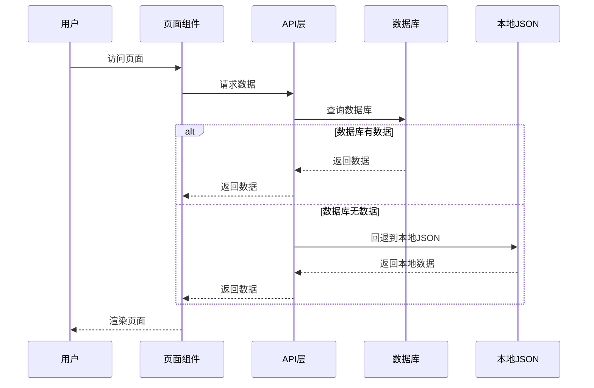
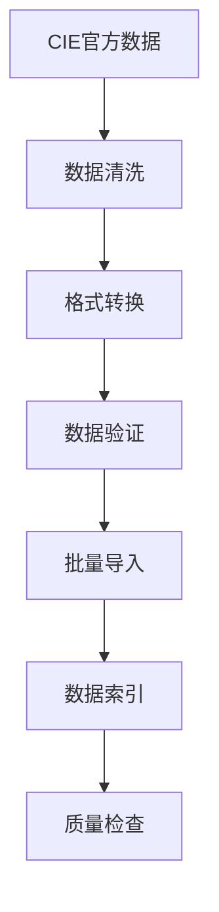
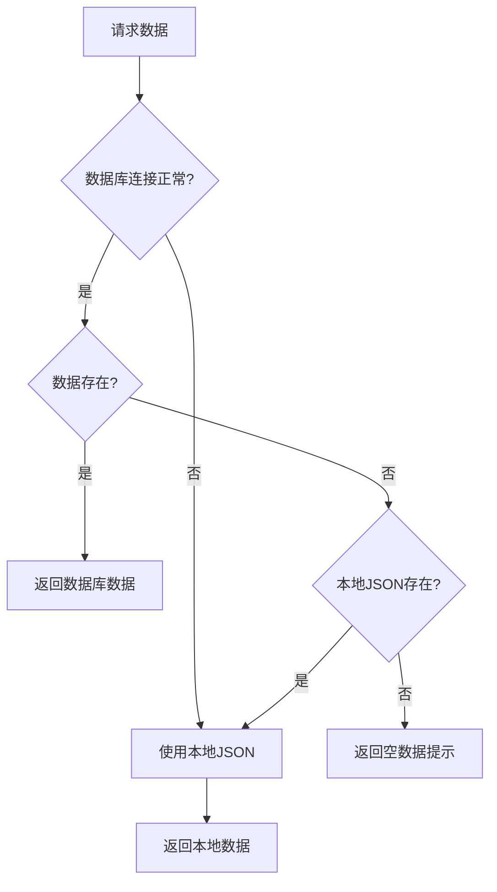

# 网站重构对齐 - 系统设计文档

## 文档概述

基于CONSENSUS文档的需求分析，本设计文档详细规划了CIE Copilot网站重构的技术实现方案。重点解决缺失页面、数据内容填充和Smart Function功能完善三个核心问题。

## 整体架构设计

### 系统架构图

```mermaid
graph TB
    subgraph "前端应用层"
        A[React App] --> B[路由系统]
        B --> C[StudyHub页面]
        B --> D[Smart Function页面]
        B --> E[Pricing页面]
        B --> F[Community页面]
    end
    
    subgraph "数据服务层"
        G[Supabase Client] --> H[认证服务]
        G --> I[数据库服务]
        G --> J[存储服务]
    end
    
    subgraph "数据存储层"
        K[(PostgreSQL)]
        K --> L[学科数据表]
        K --> M[试卷数据表]
        K --> N[主题数据表]
        K --> O[社区数据表]
    end
    
    A --> G
    I --> K
end
```

### 核心组件设计

#### 1. 页面组件层级
```
src/pages/
├── StudyHub.jsx ✅ (已完善)
├── SubjectPage.jsx ✅ (已完善)
├── PaperPage.jsx ✅ (已完善)
├── Pricing.jsx ❌ (需创建)
├── Tools/
│   ├── ToolsImageSolver.jsx ✅ (需优化)
│   ├── ToolsProgressTracking.jsx ✅ (需优化)
│   ├── ToolsSmartRecommendations.jsx ✅ (需优化)
│   └── ToolsStudySuggestions.jsx ✅ (需优化)
└── Community/
    ├── CommunityAndRecommendations.jsx ✅ (已完善)
    └── QuestionDetail.jsx ✅ (已完善)
```

#### 2. 数据流设计


## 模块设计详情

### 模块1: Pricing页面创建

#### 功能需求
- 展示CIE Copilot的定价方案
- 支持订阅管理功能
- 集成支付系统（可选）
- 响应式设计适配

#### 技术实现
```jsx
// Pricing.jsx 组件结构
const Pricing = () => {
  return (
    <div className="pricing-container">
      <PricingHeader />
      <PricingPlans />
      <PricingFeatures />
      <PricingFAQ />
    </div>
  );
};
```

#### 接口设计
```javascript
// 定价相关API
const pricingApi = {
  getPlans: () => Promise<Plan[]>,
  createSubscription: (planId) => Promise<Subscription>,
  cancelSubscription: (subscriptionId) => Promise<void>
};
```

### 模块2: 数据内容填充系统

#### 数据模型设计
```sql
-- 扩展现有数据表
ALTER TABLE subjects ADD COLUMN description TEXT;
ALTER TABLE papers ADD COLUMN difficulty_level INTEGER;
ALTER TABLE topics ADD COLUMN learning_objectives TEXT[];

-- 新增学习资源表
CREATE TABLE learning_resources (
  id UUID PRIMARY KEY DEFAULT gen_random_uuid(),
  topic_id UUID REFERENCES topics(id),
  resource_type VARCHAR(50), -- 'video', 'document', 'exercise'
  title VARCHAR(255),
  content_url TEXT,
  description TEXT,
  created_at TIMESTAMP DEFAULT NOW()
);
```

#### 数据导入流程


### 模块3: Smart Function功能增强

#### 图像问题解决器优化
```javascript
// 增强的图像处理API
const imageProcessingApi = {
  analyzeImage: async (imageFile) => {
    // 1. 图像预处理
    const processedImage = await preprocessImage(imageFile);
    
    // 2. OCR文字识别
    const extractedText = await performOCR(processedImage);
    
    // 3. 数学公式识别
    const mathFormulas = await recognizeMath(processedImage);
    
    // 4. 问题类型分类
    const questionType = await classifyQuestion(extractedText);
    
    // 5. 生成解答
    const solution = await generateSolution(questionType, extractedText, mathFormulas);
    
    return {
      extractedText,
      mathFormulas,
      questionType,
      solution
    };
  }
};
```

#### 进度追踪系统设计
```javascript
// 学习进度数据模型
const progressSchema = {
  userId: 'UUID',
  subjectCode: 'STRING',
  paperCode: 'STRING',
  topicId: 'UUID',
  completionRate: 'FLOAT', // 0-1
  timeSpent: 'INTEGER', // 分钟
  lastAccessed: 'TIMESTAMP',
  masteryLevel: 'ENUM', // 'beginner', 'intermediate', 'advanced'
  weakAreas: 'ARRAY<STRING>'
};
```

## 接口契约定义

### API接口规范

#### 1. 学习数据API
```typescript
interface LearningDataAPI {
  // 获取学科列表
  getSubjects(): Promise<Subject[]>;
  
  // 获取试卷列表
  getPapers(subjectCode: string): Promise<Paper[]>;
  
  // 获取主题列表
  getTopics(subjectCode: string, paperCode: string): Promise<Topic[]>;
  
  // 获取学习资源
  getLearningResources(topicId: string): Promise<LearningResource[]>;
}
```

#### 2. Smart Function API
```typescript
interface SmartFunctionAPI {
  // 图像问题解决
  solveImageProblem(image: File): Promise<SolutionResult>;
  
  // 获取学习进度
  getProgress(userId: string): Promise<ProgressData>;
  
  // 获取智能推荐
  getRecommendations(userId: string, context: LearningContext): Promise<Recommendation[]>;
  
  // 获取学习建议
  getStudySuggestions(userId: string, weakAreas: string[]): Promise<StudySuggestion[]>;
}
```

### 组件接口规范

#### Props接口定义
```typescript
// Pricing组件Props
interface PricingProps {
  currentPlan?: string;
  onPlanSelect?: (planId: string) => void;
  showFeatureComparison?: boolean;
}

// Smart Function组件通用Props
interface SmartFunctionProps {
  userId: string;
  onResult?: (result: any) => void;
  onError?: (error: Error) => void;
  loading?: boolean;
}
```

## 异常处理策略

### 错误分类和处理

```javascript
// 统一错误处理
class ErrorHandler {
  static handle(error, context) {
    switch (error.type) {
      case 'NETWORK_ERROR':
        return this.handleNetworkError(error, context);
      case 'DATA_NOT_FOUND':
        return this.handleDataNotFound(error, context);
      case 'PERMISSION_DENIED':
        return this.handlePermissionDenied(error, context);
      case 'VALIDATION_ERROR':
        return this.handleValidationError(error, context);
      default:
        return this.handleUnknownError(error, context);
    }
  }
  
  static handleNetworkError(error, context) {
    // 网络错误处理：重试机制、离线模式
    if (context.hasLocalData) {
      return context.loadLocalData();
    }
    throw new UserFriendlyError('网络连接失败，请检查网络设置');
  }
  
  static handleDataNotFound(error, context) {
    // 数据未找到：回退到默认数据或本地JSON
    if (context.hasLocalFallback) {
      return context.loadLocalFallback();
    }
    return { data: [], message: '暂无相关数据' };
  }
}
```

### 数据回退机制



## 性能优化设计

### 1. 代码分割和懒加载
```javascript
// 路由级别的代码分割
const Pricing = React.lazy(() => import('./pages/Pricing'));
const ToolsImageSolver = React.lazy(() => import('./pages/ToolsImageSolver'));

// 组件级别的懒加载
const HeavyComponent = React.lazy(() => 
  import('./components/HeavyComponent')
);
```

### 2. 数据缓存策略
```javascript
// 实现简单的内存缓存
class DataCache {
  constructor(ttl = 300000) { // 5分钟TTL
    this.cache = new Map();
    this.ttl = ttl;
  }
  
  set(key, data) {
    this.cache.set(key, {
      data,
      timestamp: Date.now()
    });
  }
  
  get(key) {
    const item = this.cache.get(key);
    if (!item) return null;
    
    if (Date.now() - item.timestamp > this.ttl) {
      this.cache.delete(key);
      return null;
    }
    
    return item.data;
  }
}
```

### 3. 图像处理优化
```javascript
// 图像压缩和预处理
const optimizeImage = async (file) => {
  const canvas = document.createElement('canvas');
  const ctx = canvas.getContext('2d');
  const img = new Image();
  
  return new Promise((resolve) => {
    img.onload = () => {
      // 限制最大尺寸
      const maxWidth = 1024;
      const maxHeight = 1024;
      
      let { width, height } = img;
      
      if (width > maxWidth || height > maxHeight) {
        const ratio = Math.min(maxWidth / width, maxHeight / height);
        width *= ratio;
        height *= ratio;
      }
      
      canvas.width = width;
      canvas.height = height;
      
      ctx.drawImage(img, 0, 0, width, height);
      
      canvas.toBlob(resolve, 'image/jpeg', 0.8);
    };
    
    img.src = URL.createObjectURL(file);
  });
};
```

## 测试策略

### 单元测试覆盖
```javascript
// Pricing组件测试
describe('Pricing Component', () => {
  test('renders pricing plans correctly', () => {
    render(<Pricing />);
    expect(screen.getByText('定价方案')).toBeInTheDocument();
  });
  
  test('handles plan selection', () => {
    const onPlanSelect = jest.fn();
    render(<Pricing onPlanSelect={onPlanSelect} />);
    
    fireEvent.click(screen.getByText('选择方案'));
    expect(onPlanSelect).toHaveBeenCalled();
  });
});

// Smart Function测试
describe('Image Solver', () => {
  test('processes image correctly', async () => {
    const mockFile = new File([''], 'test.jpg', { type: 'image/jpeg' });
    const result = await imageProcessingApi.analyzeImage(mockFile);
    
    expect(result).toHaveProperty('extractedText');
    expect(result).toHaveProperty('solution');
  });
});
```

### 集成测试
```javascript
// 数据流集成测试
describe('Data Flow Integration', () => {
  test('falls back to local JSON when database fails', async () => {
    // 模拟数据库连接失败
    jest.spyOn(supabase, 'from').mockRejectedValue(new Error('Connection failed'));
    
    const result = await loadPaperData('9709', 'p1');
    
    // 验证回退到本地数据
    expect(result.source).toBe('local');
    expect(result.data).toBeDefined();
  });
});
```

---

**文档版本**: v1.0  
**创建时间**: 2024年1月  
**状态**: 设计完成，待实施