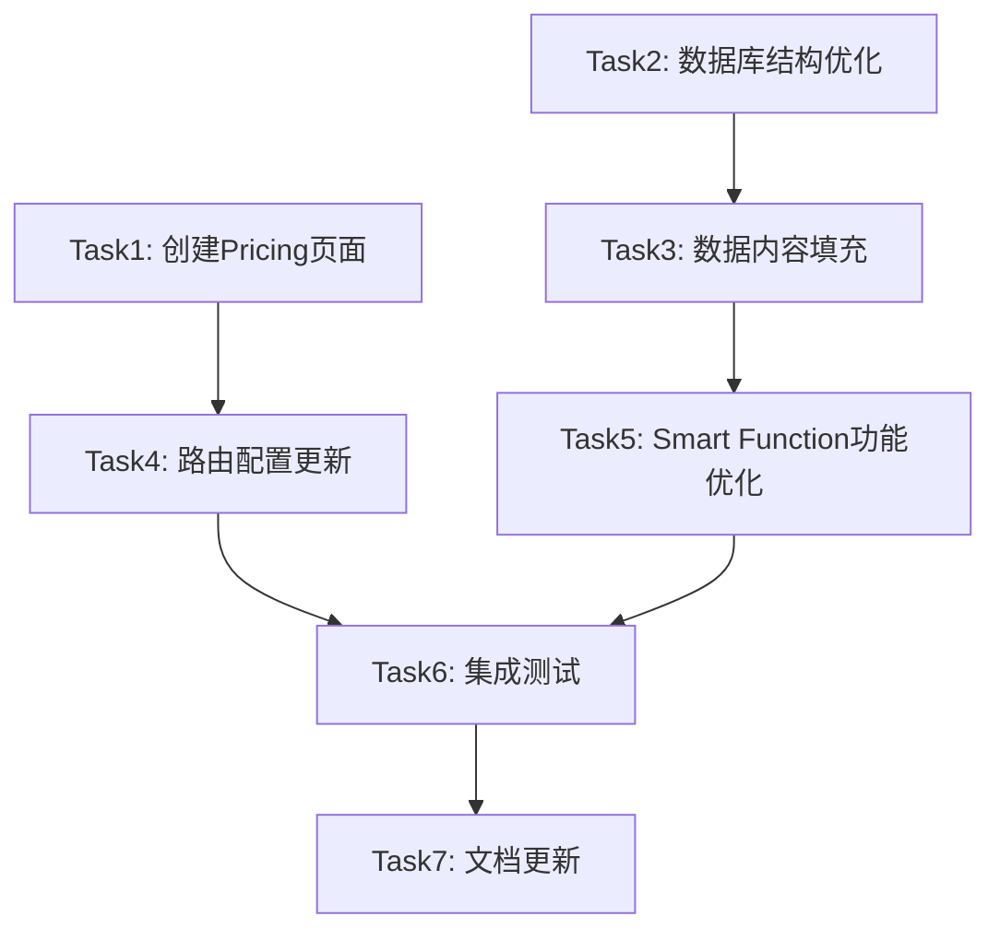

# 网站重构对齐 - 任务拆分文档

## 文档概述

基于DESIGN文档的架构设计，本文档将重构任务拆分为具体的原子化任务，确保每个任务都有明确的输入契约、输出契约和验收标准。

## 任务依赖关系图

## 原子化任务列表

### Task 1: 创建Pricing页面

**任务描述**: 创建完整的定价页面，解决导航栏链接404问题

**输入契约**:
- 前置依赖: 无
- 输入数据: 现有项目结构和样式系统
- 环境依赖: React开发环境、Tailwind CSS

**输出契约**:
- 输出数据: 完整的Pricing.jsx组件
- 交付物: 
  - `src/pages/Pricing.jsx` 文件
  - 响应式定价页面UI
  - 定价计划展示组件
- 验收标准:
  - [ ] `/pricing` 路由可正常访问
  - [ ] 页面样式与现有设计系统一致
  - [ ] 移动端适配完整
  - [ ] 包含至少3个定价方案
  - [ ] 包含功能对比表格

**实现约束**:
- 技术栈: React + Tailwind CSS
- 接口规范: 遵循现有组件命名规范
- 质量要求: 代码可读性高，组件可复用

**依赖关系**:
- 后置任务: Task4 (路由配置更新)
- 并行任务: 无

---

### Task 2: 数据库结构优化

**任务描述**: 优化现有数据库结构，为三门核心科目数据填充做准备

**输入契约**:
- 前置依赖: 无
- 输入数据: 现有Supabase数据库结构
- 环境依赖: Supabase访问权限

**输出契约**:
- 输出数据: 优化后的数据库表结构
- 交付物:
  - 数据库迁移脚本
  - 更新后的表结构文档
  - 数据验证规则
- 验收标准:
  - [ ] subjects表支持三门核心科目
  - [ ] papers表结构完整
  - [ ] topics表支持学习目标字段
  - [ ] 新增learning_resources表
  - [ ] 所有外键关系正确

**实现约束**:
- 技术栈: PostgreSQL + Supabase
- 接口规范: 遵循现有数据库命名规范
- 质量要求: 数据完整性约束完善

**依赖关系**:
- 后置任务: Task3 (数据内容填充)
- 并行任务: Task1

---

### Task 3: 数据内容填充

**任务描述**: 为数学、进阶数学、物理三门科目填充完整的学习数据

**输入契约**:
- 前置依赖: Task2 (数据库结构优化)
- 输入数据: CIE官方考纲数据、现有部分数据
- 环境依赖: 数据导入脚本环境

**输出契约**:
- 输出数据: 完整的三门科目数据
- 交付物:
  - 数学(9709)完整主题和试卷数据
  - 进阶数学(9231)完整主题和试卷数据
  - 物理(9702)完整主题和试卷数据
  - 数据导入脚本
- 验收标准:
  - [ ] 每门科目至少包含20个主题
  - [ ] 每门科目至少包含10套试卷
  - [ ] 所有数据符合CIE考纲结构
  - [ ] 数据关联关系正确
  - [ ] 数据质量检查通过

**实现约束**:
- 技术栈: Node.js + Supabase Client
- 接口规范: 遵循现有数据格式
- 质量要求: 数据准确性和完整性

**依赖关系**:
- 后置任务: Task5 (Smart Function功能优化)
- 并行任务: Task1

---

### Task 4: 路由配置更新

**任务描述**: 更新App.jsx中的路由配置，确保所有导航链接正常工作

**输入契约**:
- 前置依赖: Task1 (创建Pricing页面)
- 输入数据: 新创建的Pricing组件
- 环境依赖: React Router环境

**输出契约**:
- 输出数据: 更新后的路由配置
- 交付物:
  - 更新的`src/App.jsx`文件
  - 路由测试用例
- 验收标准:
  - [ ] `/pricing` 路由正确配置
  - [ ] 所有现有路由正常工作
  - [ ] 404页面正确处理
  - [ ] 路由懒加载正常

**实现约束**:
- 技术栈: React Router v6
- 接口规范: 遵循现有路由结构
- 质量要求: 路由性能优化

**依赖关系**:
- 后置任务: Task6 (集成测试)
- 并行任务: Task2, Task3

---

### Task 5: Smart Function功能优化

**任务描述**: 优化现有Smart Function工具的功能实现

**输入契约**:
- 前置依赖: Task3 (数据内容填充)
- 输入数据: 完整的科目数据、现有工具页面
- 环境依赖: AI API访问权限

**输出契约**:
- 输出数据: 优化后的Smart Function工具
- 交付物:
  - 优化的图像问题解决器
  - 增强的进度追踪功能
  - 改进的智能推荐系统
  - 完善的学习建议功能
- 验收标准:
  - [ ] 图像识别准确率提升
  - [ ] 进度追踪数据可视化
  - [ ] 推荐算法基于真实数据
  - [ ] 学习建议个性化
  - [ ] 所有工具响应速度优化

**实现约束**:
- 技术栈: React + AI APIs
- 接口规范: 遵循现有API设计
- 质量要求: 用户体验流畅

**依赖关系**:
- 后置任务: Task6 (集成测试)
- 并行任务: Task4

---

### Task 6: 集成测试

**任务描述**: 对整个系统进行集成测试，确保所有功能正常工作

**输入契约**:
- 前置依赖: Task4, Task5
- 输入数据: 完整的应用系统
- 环境依赖: 测试环境配置

**输出契约**:
- 输出数据: 测试报告和修复方案
- 交付物:
  - 集成测试用例
  - 测试执行报告
  - Bug修复记录
- 验收标准:
  - [ ] 所有页面可正常访问
  - [ ] 导航功能完整
  - [ ] 数据加载正常
  - [ ] Smart Function工具可用
  - [ ] 移动端兼容性良好

**实现约束**:
- 技术栈: Jest + React Testing Library
- 接口规范: 遵循测试最佳实践
- 质量要求: 测试覆盖率>80%

**依赖关系**:
- 后置任务: Task7 (文档更新)
- 并行任务: 无

---

### Task 7: 文档更新

**任务描述**: 更新项目文档，记录所有变更和新功能

**输入契约**:
- 前置依赖: Task6 (集成测试)
- 输入数据: 完成的功能实现
- 环境依赖: 文档编写环境

**输出契约**:
- 输出数据: 完整的项目文档
- 交付物:
  - 更新的README.md
  - API文档更新
  - 用户使用指南
  - 开发者文档
- 验收标准:
  - [ ] 所有新功能有文档说明
  - [ ] API接口文档完整
  - [ ] 部署指南更新
  - [ ] 故障排除指南完善

**实现约束**:
- 技术栈: Markdown
- 接口规范: 遵循现有文档格式
- 质量要求: 文档清晰易懂

**依赖关系**:
- 后置任务: 无
- 并行任务: 无

## 任务执行计划

### 第一阶段 (并行执行)
- Task1: 创建Pricing页面 (预计2小时)
- Task2: 数据库结构优化 (预计3小时)

### 第二阶段 (依赖执行)
- Task3: 数据内容填充 (预计4小时)
- Task4: 路由配置更新 (预计1小时)

### 第三阶段 (并行执行)
- Task5: Smart Function功能优化 (预计5小时)

### 第四阶段 (顺序执行)
- Task6: 集成测试 (预计2小时)
- Task7: 文档更新 (预计1小时)

## 风险评估

### 高风险任务
- Task3: 数据内容填充 - 数据质量和完整性风险
- Task5: Smart Function功能优化 - AI API依赖风险

### 缓解策略
- 数据验证脚本确保质量
- API错误处理和降级方案
- 充分的测试覆盖

## 质量门控

每个任务完成后必须通过以下检查:
1. 功能验收标准100%满足
2. 代码质量检查通过
3. 单元测试覆盖率达标
4. 文档同步更新完成
5. 无引入新的技术债务

## 交付确认

项目完成的最终验收标准:
- [ ] 所有导航链接正常工作
- [ ] 三门核心科目数据完整
- [ ] Smart Function工具功能完善
- [ ] 系统性能满足要求
- [ ] 文档完整准确
- [ ] 用户体验流畅